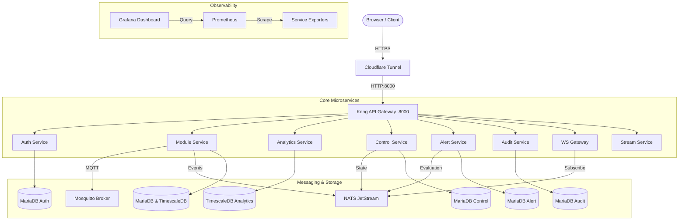

<div align="center">

# Enterprise IoT Modular Microservices

### *High-Performance, Event-Driven Environment Monitoring & Industrial IoT Architecture*

[](./docs/planning.md)
[](./docker-compose.yml)
[](https://go.dev/)
[](https://www.python.org/)
[](https://konghq.com/)
[](https://nats.io/)
[](https://mermaid.js.org/)
[](./LICENSE)

---

<p align="center">
  <a href="#key-features">Key Features</a> •
  <a href="#system-architecture">Architecture</a> •
  <a href="#tech-stack">Tech Stack</a> •
  <a href="#microservices-ecosystem">Microservices</a> •
  <a href="#quick-start">Quick Start</a> •
  <a href="#documentation">Documentation</a> •
  <a href="#license">License</a>
</p>

</div>

---

## 📌 Overview

**Enterprise IoT Modular Microservices** is a production-grade, event-driven environment monitoring and control platform designed for high throughput, strict service isolation, and horizontal scalability. 

Built with a **database-per-service pattern**, it ingests telemetry from IoT sensor nodes via MQTT, evaluates threshold alerts in real-time, stores time-series data using TimescaleDB, and streams live telemetry to a React Vite dashboard over WebSocket.

---

## 🚀 Key Features

- ⚡ **Database-per-Service Isolation**: Complete schema and storage autonomy across all services (MariaDB, TimescaleDB, Redis).
- 🔄 **Event-Driven Messaging**: High-throughput pub/sub and state streaming powered by **NATS JetStream** and **Mosquitto MQTT**.
- 🛡️ **Centralized API Gateway**: **Kong 3.6** handles `/v1` API Versioning (transparent reverse proxying), JWT validation, RBAC, Rate Limiting, and CORS policies as the single entry point.
- 📊 **Real-Time Dashboard**: React (Vite + Tailwind) frontend with a **NATS-to-WebSocket bridge** for live telemetry streaming and manual actuator control.
- 📈 **Time-Series Analytics**: Aggregated rollup metrics and time-series history powered by **TimescaleDB**.
- 👁️ **Computer Vision & ML Pipeline**: Real-time object detection via MediaMTX RTSP/HLS and YOLO inference engine.
- 🔍 **Full Observability**: Prometheus metrics aggregation paired with Grafana dashboards for database, message broker, and container resource monitoring.
- 🔒 **Zero-Trust Ingress**: Outbound-only **Cloudflare Tunnel** integration eliminating open inbound host ports.

---

## 🏗️ System Architecture



For complete architectural details, bounded contexts, and system design decisions, refer to [docs/planning.md](./docs/planning.md).

---

## 🛠️ Tech Stack

| Layer | Technologies |
|---|---|
| **Backend Services** | Go 1.26 (Microservices) · Python 3.11 (ML Service / YOLO) |
| **Frontend** | React 18 · Vite · Tailwind CSS |
| **API Gateway** | Kong 3.6 (Declarative Configuration) |
| **Message Broker** | NATS JetStream 2.10 · Eclipse Mosquitto 2 (MQTT) |
| **Databases** | MariaDB 10.11 · TimescaleDB 2.17 (PostgreSQL 16) · Redis 7 |
| **Storage & Media** | MinIO (S3 Object Store) · MediaMTX (RTSP/HLS/WebRTC) |
| **Monitoring** | Prometheus v3.4 · Grafana 11.3 · Node Exporter · cAdvisor |
| **Ingress & DevOps** | Cloudflare Tunnel · Docker Compose v2 · GitHub Actions CI/CD |

---

## 🧩 Microservices Ecosystem

| Microservice | Port | Database | Primary Responsibility |
|---|---|---|---|
| `auth` | `8080` | MariaDB (`auth_db`) | Authentication, RBAC, JWT issuance, and refresh tokens |
| `module` | `8080` | MariaDB + TimescaleDB | Device registry, MQTT discovery, and telemetry ingest |
| `analytics` | `8080` | TimescaleDB (`analytics_ts`) | Time-series rollups, aggregated queries, and analytics |
| `control` | `8080` | MariaDB (`control_db`) | Manual/scheduled actuator commands & mode arbitration |
| `alert` | `8080` | MariaDB (`alert_db`) | Rule-based threshold evaluation & alert history |
| `audit` | `8080` | MariaDB (`audit_db`) | Append-only system audit log store |
| `notification`| `8080` | MariaDB (`notification_db`)| Multi-channel alert dispatcher (Telegram, Email, Push) |
| `stream` | `8080` | MariaDB (`stream_db`) | Camera stream metadata, MediaMTX paths & snapshots |
| `ml` | `8080` | MariaDB (`ml_db`) | YOLO computer vision model registry & inference API |
| `export` | `8080` | Redis Shared (DB 3) | Data export processing (CSV) |
| `wsgateway` | `8090` | Memory | Single bridged WebSocket for real-time telemetry |
| `dlq` | `8080` | MariaDB (`audit_db`) | Dead Letter Queue saga worker for failed messages |

---

## 📂 Project Structure

```
.
├── .github/workflows/     # CI/CD pipeline (GitHub Actions)
├── dashboard/             # React + Vite frontend application
├── docs/                  # System documentation, ADRs, runbooks & guides
│   ├── integration-guides/# Service-specific API contracts & examples
│   ├── adr.md             # Architecture Decision Records
│   ├── planning.md        # Core system architecture & design rationale
│   └── runbook.md         # Operational troubleshooting & diagnostics
├── firmware/              # ESP32 node firmware & hardware simulator
├── infra/                 # Infrastructure configs (Kong, NATS, Mosquitto, Prometheus, Grafana)
├── services/              # Go & Python microservices
└── docker-compose.yml     # Master container orchestration manifest
```

---

## ⚡ Quick Start

### 1. Prerequisites
- [Docker Engine 24.0+](https://docs.docker.com/engine/install/)
- [Docker Compose v2.20+](https://docs.docker.com/compose/)
- [Git](https://git-scm.com/)

### 2. Installation & Running

```bash
# Clone the repository
git clone https://github.com/Rezen351/enterprise-iot-modular-microservices.git
cd enterprise-iot-modular-microservices

# Configure Environment
cp .env.example .env
# Edit .env to set your JWT secrets, DB passwords, and Cloudflare tokens

# Start the full microservices stack
docker compose up -d

# Verify Gateway Health
curl http://localhost:8000/v1/health
```

### 3. Local Dashboard Development

```bash
cd dashboard
npm install
npm run dev
```
Access the dashboard at `http://localhost:5173`.

---

## 🔄 CI/CD Pipeline

The project incorporates an automated GitHub Actions pipeline ([.github/workflows/ci-cd.yml](./.github/workflows/ci-cd.yml)):

- **CI Stage**: Runs `gofmt`, `go vet`, and `go build` across all Go services, executes `pytest` for the ML service, lints the React dashboard, and builds Docker images using **Docker Buildx layer caching (`type=gha`)**.
- **CD Stage**: Automated deployment to a self-hosted runner on `push` to `main`, leveraging **Sparse Checkout** (`docker-compose.yml`, `infra/`) to minimize network bandwidth down to ~5MB per release.

---

## 📖 Documentation Index

| Document | Description |
|---|---|
| [planning.md](./docs/planning.md) | Full architectural blueprint, bounded contexts, and system design |
| [adr.md](./docs/adr.md) | Architecture Decision Records (ADRs) and trade-offs |
| [roadmap.md](./docs/roadmap.md) | Development phase status and feature checklists |
| [runbook.md](./docs/runbook.md) | Operational runbook & troubleshooting guidelines |
| [security-audit.md](./docs/security-audit.md) | Penetration testing report & security hardening policies |
| [integration-guides/](./docs/integration-guides/) | Service-by-service API contracts, NATS/MQTT topics & curl examples |
| [AGENTS.md](./AGENTS.md) | Project guidelines, code standards, and commit rules |

---

## 📄 License

Distributed under the **MIT License**. See [LICENSE](./LICENSE) for more information.
