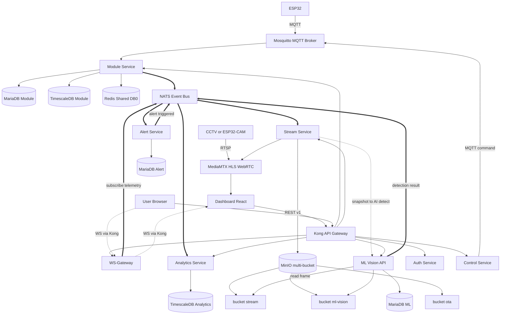

# 📋 Planning — IOT-Modular-Microservice

> **Versi Dokumen:** 2.16.0  
> **Tanggal:** 2026-07-16  
> **Status:** 🟢 Fase 1-5 + Monitor Selesai — + Hardening Arsitektur (2.12–2.16: resilience, outbox, testing, deployment, SLA, TA-Scale Roadmap, cosmetic cleanup) 
> **Penulis:** Alif Muhammad Rizky
> **Dokumen Terkait:** [roadmap.md](file:///home/almuzky/TA/Microservices/docs/roadmap.md) · [adr.md](file:///home/almuzky/TA/Microservices/docs/adr.md) · [runbook.md](file:///home/almuzky/TA/Microservices/docs/runbook.md) · [security-audit.md](file:///home/almuzky/TA/Microservices/docs/security-audit.md) · [logs.md](file:///home/almuzky/TA/Microservices/logs.md) · [testing-plan-agent.md](file:///home/almuzky/TA/Microservices/docs/testing-plan-agent.md) · [AGENTS.md](file:///home/almuzky/TA/Microservices/AGENTS.md)

---

## 🎯 Tujuan Proyek

Membangun sistem monitoring dan kontrol tanaman aeroponik berbasis **arsitektur microservice** dengan pendekatan **Database-per-Service**, komunikasi event-driven via **NATS**, dan API Gateway terpusat via **Kong**. Sistem dirancang untuk berjalan di lingkungan containerized (Docker Compose) dan dapat di-deploy ke cloud melalui **Cloudflare Tunnel**.

---

## 🧠 Filosofi Modular Desain

Sistem dirancang dengan filosofi modular yang berlandaskan pada prinsip pemisahan concern (separation of concerns) dan otonomi layanan. Setiap modul dalam sistem memiliki tanggung jawab yang jelas dan terisolasi, memungkinkan pengembangan, pengujian, dan deployment secara independen.

### Prinsip Modular yang Diadopsi

| Prinsip | Deskripsi | Implementasi dalam Sistem |
|---|---|---|
| **Single Responsibility** | Setiap service hanya bertanggung jawab atas satu domain bisnis | Auth Service hanya menangani autentikasi, Module Service hanya menangani data sensor & device onboarding, Analytics Service hanya menangani agregasi data — tidak ada overlap tanggung jawab |
| **Database Isolation** | Setiap service memiliki database sendiri, tidak ada sharing database antar service | 17 instance database terpisah untuk 13 service (MinIO dikonsolidasi jadi 1 instance bersama multi-bucket), masing-masing dengan kredensial unik |
| **Bounded Context** | Setiap service memiliki model data dan bahasa domain sendiri | Service Auth berbicara tentang "user" dan "role", Module Service berbicara tentang "sensor" dan "telemetry", Control Service berbicara tentang "command" dan "device" |
| **Independen Deployable** | Setiap service dapat di-build, di-deploy, dan di-scale secara independen | Masing-masing service memiliki Dockerfile sendiri, go.mod mandiri, dan port internal yang terisolasi |
| **Resilience by Design** | Kegagalan satu service tidak boleh mengganggu service lain | NATS event bus dengan JetStream persistence, saga pattern dengan compensating transaction, dan dead letter queue untuk menangani kegagalan |
| **Observability Built-in** | Setiap service harus menghasilkan data observability secara default | Audit log via NATS untuk setiap operasi kritis, healthcheck endpoint, metrik Prometheus, dan saga tracing dengan correlation ID |
| **Stateless where Possible** | Service diusahakan stateless untuk memudahkan horizontal scaling | WebSocket Service, API Gateway, dan Webhook Service bersifat stateless; state disimpan di database dan cache eksternal |
| **API Contract First** | Komunikasi antar-service didefinisikan melalui kontrak yang jelas | NATS subject contract, MQTT topic contract, REST API contract, dan webhook payload schema didokumentasikan sebelum implementasi |

### Manfaat Arsitektur Modular

- **Skalabilitas Selektif:** Hanya service yang membutuhkan resource tambahan yang di-scale, bukan seluruh sistem. Module Service yang menangani volume data sensor tinggi dapat di-scale secara independen dari Auth Service yang bebannya lebih rendah.
- **Isolasi Kegagalan:** Kerusakan pada satu service tidak merambat ke service lain. Jika Vision API mengalami error, sistem monitoring dan kontrol tetap berjalan normal.
- **Kebebasan Teknologi:** Setiap service dapat menggunakan stack teknologi yang paling sesuai. Service Go untuk performa tinggi, Python untuk ML inference, JavaScript untuk frontend — semuanya berkomunikasi melalui protokol yang terstandarisasi.
- **Paralelisasi Pengembangan:** Tim yang berbeda dapat mengerjakan service yang berbeda secara simultan tanpa konflik, selama kontrak antar-service (NATS subjects, API endpoints) sudah disepakati.
- **Evolusi Independen:** Setiap service dapat diperbarui, diganti, atau bahkan dihapus tanpa mempengaruhi service lain selama kontrak komunikasi tetap dipenuhi.

### Batasan dan Trade-off

- **Kompleksitas Operasional:** 17 instance database dan 13+ service membutuhkan monitoring dan orkestrasi yang lebih kompleks dibandingkan monolit.
- **Network Overhead:** Komunikasi antar-service via NATS menambah latency dibandingkan pemanggilan fungsi langsung dalam monolit.
- **Data Consistency:** Eventual consistency adalah konsekuensi dari arsitektur terdistribusi — transaksi yang membutuhkan strong consistency harus menggunakan saga pattern dengan compensating transaction.
- **Debugging Complexity:** Melacak alur transaksi yang melintasi beberapa service membutuhkan tool observability yang memadai (distributed tracing, centralized logging).

---

## 🏗️ Arsitektur Sistem

### Topologi

Sistem terdiri dari beberapa lapisan yang saling terintegrasi:

- **Device Layer:** ESP32 mengirim data sensor via MQTT ke Mosquitto broker
- **Ingestion Layer:** Module Service menerima data dari Mosquitto, menyimpan ke database (MariaDB + TimescaleDB), dan mempublikasikan ke NATS
- **Processing Layer:** Analytics Service, Stream Service (MediaMTX + MinIO *bucket `stream`*), dan (future) ML/Vision API (MinIO *bucket `ml-vision`* di instance MinIO bersama) memproses data secara real-time
- **Control Layer:** Control Service mengirim perintah balik ke ESP32 melalui MQTT
- **Streaming Layer:** Stream Service + MediaMTX (RTSP→HLS/WebRTC) + MinIO bersama (bucket `stream`: snapshot/recording) untuk kamera CCTV/ESP32-CAM
- **Gateway Layer:** Kong sebagai API Gateway tunggal untuk semua traffic eksternal, termasuk REST/HTTP dan WebSocket (route `/ws` diteruskan ke WS-Gateway)
- **Presentation Layer:** Dashboard (React) dan **WS-Gateway** untuk real-time updates. Dashboard membuka WebSocket ke Kong (`/ws`), Kong meneruskan ke WS-Gateway, yang menjadi jembatan ke **NATS** (subscribe subject untuk push ke client)
- **Integration Layer:** Webhook Service sebagai jembatan event-driven ke sistem eksternal
- **Observability Layer:** Prometheus + exporter terkonsolidasi (1× mysqld-exporter-all untuk 8 MariaDB, 1× postgres-exporter-all untuk 2 TimescaleDB, 1× redis-exporter untuk redis-shared, + mosquitto/nats/node/cadvisor) untuk aggregasi metrik; Monitor Service untuk resource container
- **Infrastructure Layer:** NATS untuk event bus, Cloudflare Tunnel (scaffold) untuk akses aman dari internet

### Diagram Alur Data End-to-End (Saat Ini)

```
ESP32 → MQTT (Mosquitto) → Module Service → MariaDB (metadata)
                                            → TimescaleDB (time-series)
                                            → Redis (cache)
                                             → NATS (telemetry.ingest + telemetry.batch)
                                                  → Analytics Service → TimescaleDB (analytics)
                                                   → WS-Gateway (subscribe mqtt.> / system.status) → WebSocket → Dashboard (realtime telemetry)
                                                  → Stream Service → MediaMTX (HLS/WebRTC) + MinIO bucket `stream` (snapshot/recording)
                                                 → (future) Alert Service
                                                 → (future) Audit Service

CCTV / ESP32-CAM → RTSP → MediaMTX → Stream Service (register path) → HLS/WebRTC → Dashboard Live View

User → Browser → Kong (API Gateway) → Auth Service (JWT validation)
                                      → Module Service (CRUD modules/nodes)
                                      → Analytics Service (query agregasi)
                                      → Control Service (perintah actuator)
                                      → Stream Service (CRUD stream + snapshot/recording)
                                      → WS-Gateway (WebSocket real-time, route /ws)
```

### Diagram Alur Data (Mermaid)



> **Keterangan jalur:** garis tebal `==>` = NATS event bus antar-service · garis putus-putus `-.->` = WebSocket via Kong /ws · garis biasa `-->` = REST via Kong / MQTT / storage (lihat label pada edge).

### Prinsip Desain

| Prinsip | Implementasi |
|---|---|
| Database-per-Service | Setiap service memiliki container database sendiri, tidak ada sharing database |
| Event-Driven Architecture | Komunikasi antar-service menggunakan NATS JetStream dengan pola Pub/Sub dan Request-Reply |
| Single Entry Point | Semua traffic eksternal melalui Kong API Gateway |
| Zero-Trust Internal | Setiap service hanya mengetahui kredensial database miliknya sendiri |
| Schema Migration on Boot | Setiap service melakukan migrasi skema database sendiri saat startup |
| Saga Pattern | Transaksi terdistribusi menggunakan choreography-based saga via NATS |
| Idempotency | Semua event handler dirancang idempotent untuk menjamin exactly-once processing |

### Pola Komunikasi (3 Jalur Utama)

Agar tidak ambigu, sistem menggunakan **tiga jalur komunikasi yang berbeda** secara eksplisit. Dashboard/Client selalu berhadapan dengan **Kong** sebagai satu-satunya pintu masuk eksternal.

| Jalur | Arah & Protokol | Penjelasan |
|---|---|---|
| **1. REST API (Request-Response)** | `Dashboard/Client → Kong (HTTP/REST, prefix /v1) → <Service>` | Semua CRUD & query (Auth, Module, Analytics, Control, Stream) lewat Kong lalu ke service tujuan. Service validasi JWT sendiri (defense-in-depth). |
| **2. Realtime (WebSocket)** | `Dashboard/Client → Kong (route /ws) → WS-Gateway ⇄ NATS subject ⇄ Dashboard` | WebSocket juga lewat Kong (route `/ws`), lalu diteruskan ke WS-Gateway. WS-Gateway dirancang menjadi jembatan NATS⇄Dashboard **dua arah**: (a) **inbound** — subscribe subject NATS lalu push ke client; (b) **outbound** — menerima pesan dari client lalu publish ke subject NATS (mis. perintah realtime/control) agar service lain mengonsumsinya. **Status implementasi:** inbound **sudah jalan** — `NodeLive` subscribe `mqtt.{node_id}` (via wildcard `mqtt.>` cache) dan `SystemStatus` subscribe `system.status`/`alert.triggered`/`alert.resolved`, keduanya push ke Dashboard; outbound **menyusul** (reader goroutine saat ini membuang pesan client, belum publish ke NATS). WS-Gateway **tidak** memanggil REST service untuk membalas. Rate-limit Kong hanya menghitung handshake koneksi, bukan setiap frame — sehingga throughput realtime tidak dibatasi limit API REST. |
| **3. Inter-Service (Event Bus)** | `<Service A> → publish NATS subject → <Service B/C>` | Komunikasi antar-service **hanya** via NATS (JetStream/Core), bukan HTTP langsung antar container internal (kecuali circuit-breaker HTTP pada dependency sinkron seperti Stream→ML). DB tiap service tetap terisolasi. |

> **Inti:** REST & WebSocket dari client **sama-sama lewat Kong**. Perbedaannya: REST diakhiri oleh service (request-response), sedangkan WebSocket diteruskan Kong ke **WS-Gateway** yang menjadi jembatan NATS⇄client secara **dua arah** (realtime). Data realtime **tidak** berasal dari REST service, melainkan dari event NATS yang di-fan-out oleh WS-Gateway (inbound, via subject `mqtt.>` / `mqtt.{node_id}` dan `system.status`) atau diteruskan client ke NATS (outbound, menyusul). Kong tidak membatasi volume telemetry karena rate-limit hanya berlaku pada handshake koneksi WS, bukan per-message.

---

## 🗄️ Database per Service

Setiap service memiliki instance database terpisah sesuai dengan kebutuhan data-nya:

| Service | MariaDB | TimescaleDB | Redis (instance bersama `redis-shared`) | MinIO (instance bersama `minio`) | Status |
|---|---|---|---|---|---|
| Auth | `mariadb-auth` | — | — | — | ✅ Running |
| Module | `mariadb-module` | `timescaledb-module` | DB0 `module` | — | ✅ Running |
| Control | `mariadb-control` | — | — | — | ✅ Running |
| Stream | `mariadb-stream` | — | — | bucket `stream` | ✅ Running |
| Alert | `mariadb-alert` | — | DB1 `alert` | — | ✅ Running |
| ML / Vision | `mariadb-ml` | — | — | bucket `ml-vision` | ✅ Running |
| OTA | `mariadb-ota` | — | — | bucket `ota` | ⬜ Belum |
| Analytics | — | `timescaledb-analytics` | — | — | ✅ Running |
| Export | — | `timescaledb-module` (read) | DB3 `export` | — | ⬜ Belum |
| Notification | `mariadb-notification` | — | DB2 `notification` | — | ⬜ Belum |
| Audit | `mariadb-audit` | — | — | — | ✅ Running |
| Webhook | `mariadb-webhook` | — | — | — | ⬜ Belum |
| Monitor | — (docker stats) | — | — | — | ✅ Running |

> **Keputusan Konsolidasi MinIO (2026-07-12):** Tidak lagi membuat instance MinIO terpisah per service (`minio-stream`, `minio-ml`, `minio-ota`). Cukup **1 instance MinIO bersama** (`minio`) dengan **multi-bucket** (`stream`, `ml-vision`, `ota`) dan **access key ter-scoping per service** (prinsip *Zero-Trust Internal* tetap terjaga). Stream tetap menulis snapshot/recording ke bucket `stream` miliknya → tidak bergantung ML yang belum dibuat. ML membaca frame sumber dari bucket `stream` (key read-only) dan menulis hasil anotasi ke bucket `ml-vision`.
>
> **Keputusan Konsolidasi Redis (2026-07-16, ADR-004):** Tidak lagi membuat instance Redis terpisah per service (`redis-module`, `redis-alert`, `redis-notification`, `redis-export`). Cukup **1 instance Redis bersama** (`redis-shared`) dengan **multi-DB logical** (module=DB0, alert=DB1, notification=DB2, export=DB3) + **1 exporter bersama**. Redis hanya cache/ephemeral store (bukan sumber kebenaran domain), sehingga konsolidasi ini tidak melanggar prinsip *Database-per-Service* (MariaDB/TimescaleDB tetap per-service). cctv-capture tetap pakai DB0 milik module.

> **Keputusan Konsolidasi Exporter (2026-07-16, ADR-005):** 11 container exporter terpisah (8× mysqld, 2× postgres, 1× redis) digabung menjadi **3 container per tipe** (`mysqld-exporter-all`, `postgres-exporter-all`, `redis-exporter`). Tiap container menjalankan beberapa proses exporter pada port berbeda (satu per DB target). Jumlah job & `instance` label di Prometheus **tetap sama** (per-DB) → dashboard Grafana tidak berubah. Tujuannya mengurangi beban orkestrasi container, bukan mengurangi cakupan metrik. cAdvisor, node-exporter, mosquitto-exporter, nats-exporter, kong tetap 1 masing-masing (sudah shared).

**Object storage:** 1× instance MinIO bersama (`minio`, multi-bucket + scoped access key) untuk Stream / ML / OTA.
**Cache:** 1× instance Redis bersama (`redis-shared`, multi-DB) untuk Module / Alert / Notification / Export.
**Total instance database terpisah:** 10× MariaDB · 2× TimescaleDB · 1× Redis · 1× MinIO = **14 instance** (turun dari 17 setelah konsolidasi Redis)
**Sudah berjalan:** 4× MariaDB · 2× TimescaleDB · 1× Redis · 1× MinIO = **8 instance**

---

## 📂 Struktur Direktori

Proyek diorganisir dengan struktur sebagai berikut:

- **`docker-compose.yml`** — Definisi semua service dan instance database (saat ini: auth, module, analytics, wsgateway, nats, mosquitto, kong, prometheus)
- **`.env.example`** — Template variabel lingkungan untuk konfigurasi
- **`infra/`** — Konfigurasi infrastruktur pendukung:
  - `mariadb/` — Skema inisialisasi database per service (auth ✅, module ✅, control ⬜, alert ⬜, stream ⬜, ml ⬜, ota ⬜, notification ⬜, audit ⬜, webhook ⬜)
  - `timescaledb/` — Skema untuk time-series data (module ✅, analytics ✅)
  - `redis/` — Konfigurasi Redis bersama (`redis-shared`, multi-DB per service)
  - `minio/` — Script inisialisasi bucket
  - `nats/` — Konfigurasi NATS dengan JetStream dan ACL per-service ✅
  - `mosquitto/` — Konfigurasi MQTT broker dan ACL per-topik ✅
  - `mediamtx/` — Konfigurasi MediaMTX untuk streaming video
  - `kong/` — Konfigurasi routing, JWT validation, rate-limiting, CORS ✅
  - `prometheus/` — Konfigurasi Prometheus untuk aggregasi metrik ✅
  - `cloudflared/` — Konfigurasi tunnel Cloudflare
- **`services/`** — Kode sumber microservices:
  - `auth/` ✅ — Service autentikasi (Go)
  - `module/` ✅ — Service manajemen device & telemetri (Go)
  - `analytics/` ✅ — Service agregasi data time-series (Go)
  - `wsgateway/` ✅ — WebSocket bridge NATS → Dashboard (Go)
  - `export/` ⬜ — Service ekspor data untuk akses eksternal/Python (Go/Python)
  - `control/` ✅ — Service kontrol device
  - `alert/` ✅ — Service evaluasi threshold
  - `stream/` ⬜ — Service streaming video
  - `ota/` ⬜ — Service update firmware
  - `notification/` ⬜ — Service notifikasi multi-channel
  - `audit/` ⬜ — Service audit log
  - `webhook/` ⬜ — Service webhook eksternal
- **`ml/`** ⬜ — Service Python untuk YOLOv8 inference
- **`dashboard/`** ✅ — Frontend React untuk antarmuka pengguna
- **`docs/`** — Dokumentasi kontrak API, NATS subjects, MQTT topics, webhook payload schema
- **`volumes/`** — Persistent data storage (diabaikan oleh git)

---

## 📜 API Response & Contract Standardization

Seluruh microservice **wajib** mengikuti standar respons JSON seragam agar konsumsi data di sisi dashboard & eksternal konsisten (berlaku juga untuk error dari event yang di-surface ke REST):

| Kategori | Kontrak |
|---|---|
| Sukses (2xx) | `{ "success": true, "data": <payload/array/object> }` |
| Error (4xx/5xx) | `{ "success": false, "error": { "code": "<ERROR_CODE>", "message": "<english_message>" } }` |
| Wrapper library | Go: helper `ResponseOK`/`ResponseError` di `internal/handler` (sudah di Auth/Module/Control). Rust/Python: bentuk dict serupa. |
| Error code enum | `UNAUTHORIZED`, `FORBIDDEN`, `VALIDATION_ERROR`, `NOT_FOUND`, `CONFLICT`, `RATE_LIMITED`, `UPSTREAM_ERROR`, `INTERNAL_ERROR` |
| Health endpoint | `GET /health` → `{ "success": true, "data": { "status": "healthy", "uptime_s": 123 } }` (publik, tanpa token) |

> **Versioning:** Semua REST route di-prefix `/v1` (Kong strip prefix). Perubahan breaking → `/v2` (deprecation window minimal 1 rilis). NATS subject **tidak** di-version di topic level; backward-compat dijaga via payload `meta.schema_version`.

### Contract Documentation & Eventual Consistency (UX)

- **OpenAPI per service:** Setiap service wajib menyediakan spesifikasi **OpenAPI 3.x** (di `docs/openapi/<service>.yaml`) agar kontrak REST terdokumentasi mesin-baca, konsisten dengan NATS subject contract yang sudah ada.
- **Eventual consistency adalah keputusan UX, bukan sekadar data:** CQRS read-model (dashboard) akan lag dari write-side. Dashboard **tidak** boleh pura-pura konsisten — tunjukkan state `processing` / `syncing` (mis. badge "reconnecting…", optimistic update) agar pengguna paham data bisa tertunda. Ini mengikuti panduan Ilir Ivezaj 2026.

---

## 🔁 Idempotency & Delivery Semantics

NATS menyediakan jaminan **at-least-once**, bukan exactly-once. Oleh karena itu:

| Mekanisme | Implementasi |
|---|---|
| Dedupe key | Setiap event memuat `meta.idempotency_key` (UUID). Subscriber menyimpan key di Redis (TTL > window retry) dan menolak duplikat. |
| Idempotent write | Upsert berbasis natural key (mis. `metrics_rollup` by `(node_id, metric, bucket)`), bukan insert盲. |
| Retry & backoff | Subscriber JetStream pakai `ack` eksplisit; pesan di-redeliver hingga `MaxDeliver` (default 3) lalu masuk `saga.*.dlq`. |
| Exactly-once *effect* | Dicapai via idempotent consumer + dedupe, bukan via broker. Klaim "exactly-once processing" di prinsip desain dimaknai sebagai *exactly-once effect*, bukan *exactly-once delivery*. |

---

## 🛡️ High Availability & Resilience Infrastructure

Arsitektur saat ini berpusat pada NATS & Kong — keduanya adalah **SPOF** jika berjalan single instance. Strategi mitigasi:

| Komponen | Risiko | Strategi HA |
|---|---|---|
| NATS JetStream | Single instance → event bus mati | (Dev) single OK; (Prod) NATS **cluster 3-node** (`nats_cluster {}`) dengan JetStream replication factor ≥ 2 + `R=2` stream. Client pakai seed list `nats://n1,nats://n2,nats://n3`. |
| Kong | Single gateway → traffic eksternal mati | (Prod) 2+ replica Kong di belakang LB; atau Konnect. Dev: single. |
| MinIO | SPOF object storage | Sudah direncanakan **erasure-coding multi-drive** (≥4 drive) di host yang sama — lebih tangguh dari 2 container 1 disk. |
| MariaDB/TimescaleDB | Data per-service hilang | Backup cron (lihat DR section). Untuk prod kritis: primary-replica. |
| Service crash | Consumer mati | Restart policy `unless-stopped` + Docker healthcheck + JetStream replay (Analytics sudah demo). |

> **Resilience by design** (prinsip baris 28) baru terpenuhi penuh bila `saga.*.dlq` + compensating transaction **benar-benar terimplementasi**, bukan hanya didokumentasikan. Status saat ini: saga choreography narasi ✅, DLQ consumer (Audit) ⬜, tracing ⬜.

---

## 🔌 Resilience Patterns (Production-Grade)

Selain HA infrastruktur, setiap service harus mengadopsi pola *design for failure* agar kegagalan satu komponen tidak merambat (cascading failure). Referensi: JRebel 2026, Anji Reddy 2023, Reintech 2026.

| Pola | Definisi | Implementasi dalam Sistem |
|---|---|---|
| **Circuit Breaker** | "Saklar" otomatis yang **memutus** panggilan ke dependency yang sedang gagal/lambat. Saat error rate melampaui ambang, state → `OPEN` (tolak langsung, cepat gagal). Setelah `reset_timeout`, state → `HALF_OPEN` (izinkan sebagian request uji). Jika sukses → `CLOSED`; jika gagal → kembali `OPEN`. Mencegah satu service lambat menarik turun seluruh rantai. | Dipakai pada panggilan **HTTP antar-service** (mis. Stream → ML `/ml/detect`, Module → Auth validasi). Threshold konservatif lalu disetel via metrik. Library: `sony/gobreaker` (Go) atau `gofiber/circuit` di handler outbound. |
| **Bulkhead** | "Kompartemen kapal" — tiap dependency mendapat **pool resource terbatas** (goroutine / koneksi / semaphore) sendiri. Jika satu dependency melambat, pool-nya habis sendiri, tidak mengorbankan resource service lain. | Setiap outbound client (NATS, HTTP ke service lain, DB) diberi `maxConcurrent`/`pool size` terpisah. Worker pool NATS subscribe dibatasi per consumer. |
| **Retry + Exponential Backoff** | Ulangi panggilan gagal dengan jeda meningkat + jitter agar tidak membanjiri dependency yang sedang recovery. | NATS JetStream sudah `ack`+redeliver; untuk HTTP outbound: retry 3× dengan backoff 100ms→1s + jitter. Hindari retry pada error 4xx (client error). |
| **Timeout** | Batasi waktu tunggu tiap I/O. Tanpa timeout, goroutine menunggu selamanya → resource leak. | Set `context.WithTimeout` di semua DB/HTTP/NATS call. WS replay cache sudah jadi fallback saat live stream mati (degradasi graceful). |
| **Graceful Degradation** | Saat komponen mati, sistem tetap kasih fungsi dasar, bukan lumpuh total. | NATS mati → WS-Gateway sajikan payload terakhir dari cache `mqtt.>` (sudah ada). Dashboard tunjukkan badge "reconnecting…" daripada spinner abadi. |

> **Catatan:** Pola ini wajib untuk panggilan **sinkron** (HTTP). Komunikasi **async** via NATS JetStream sudah tahan kegagalan via persistence + replay, sehingga circuit breaker utamanya untuk HTTP, bukan pub/sub.

---

## 🗄️ Data Consistency: Transactional Outbox

Sistem saat ini menulis DB **lalu** mem-publish event NATS dalam dua langkah terpisah. Ini adalah **dual-write problem** — akar dari sebagian besar bug data terdistribusi (Ilir Ivezaj 2026): jika DB commit sukses tapi publish NATS gagal (atau sebaliknya), state tidak konsisten dan subscriber (Alert/Analytics) kehilangan event.

**Solusi — Transactional Outbox Pattern:**

1. Dalam **transaksi DB yang sama**, service menulis data bisnis **dan** menulis event ke tabel `outbox` (mis. `module_outbox` di MariaDB module).
2. Sebuah **relay** (background worker / CDC) membaca `outbox` yang belum terkirim lalu mem-publish ke NATSJetStream, lalu menandai `outbox.sent = true`.
3. Karena write DB + write outbox atomic, tidak ada event hilang maupun duplikat asal (idempotensi consumer menangani redelivery).

```
Module Service
  └─ BEGIN TX
       INSERT telemetry (TimescaleDB)
       INSERT outbox(event='telemetry.ingest', payload, msg_id)
  └─ COMMIT
Outbox Relay (worker)
  └─ SELECT unsent FROM outbox
  └─ js.Publish(subject, payload, Nats-Msg-Id=msg_id)   # dedupe publisher-side
  └─ UPDATE outbox SET sent=true WHERE id=...
```

### Exactly-Once yang Benar (NATS Resmi)

NATS JetStream mencapai exactly-once lewat dua mekanisme resmi (NATS docs):
- **Publisher dedup:** header `Nats-Msg-Id` — server melacak ID dalam window waktu, mendeteksi publish ganda.
- **Consumer double-ack:** acknowledgment dua arah mencegah redeliver salah setelah ack hilang.

Ditambah **consumer-side idempotency** (cek `msg_id` sudah diproses di Redis/DB sebelum eksekusi). Kombinasi ini — bukan sekadar "idempotent handler" — yang menjamin *exactly-once effect*.

### DLQ via NATS Advisory (Bukan Buatan Sendiri)

DLQ yang benar mengikuti mekanisme advisori NATS resmi, bukan subject `saga.*.dlq` buatan:
- Saat consumer melewati `MaxDeliver`, NATS publish advisory ke `$JS.EVENT.ADVISORY.CONSUMER.MAX_DELIVERIES.{stream}.{consumer}`.
- Worker menyubscribe advisory tersebut, mengambil pesan asli by `stream_seq`, lalu publish ke stream `DLQ` (retensi 30 hari, `Replicas: 2`) untuk investigasi Audit Service.

---

## 📡 Metrics & Observability Pipeline (Event-Driven)

Saat ini Prometheus **scrape langsung** tiap service (`/metrics`). Target akhir (Fase 11) adalah push-based via NATS agar scrape tidak bergantung network ekspos service:

### Subject `metrics.health` (JetStream, stream `METRICS`)

| Field | Tipe | Keterangan |
|---|---|---|
| `service` | string | Nama service (mis. `module-service`) |
| `status` | enum | `healthy` / `degraded` / `down` |
| `uptime_s` | int | Waktu hidup sejak start |
| `cpu_pct` | float | Usage CPU proses |
| `mem_mb` | float | RSS memory |
| `msg_in_s` | float | NATS message in per detik |
| `ts` | RFC3339 | Timestamp publish |

- **Publisher:** setiap service publish periodik (15s) ke `metrics.health`.
- **Subscriber:** (Fase 11) Prometheus Metrics Service subscribe → expose `/metrics` terpusat. Fallback: scrape langsung tetap ada hingga Fase 11 selesai.
- **Tracing:** `trace_id` (OpenTelemetry/W3C) disebar via header `X-Trace-Id` & NATS header `Trace-Id` untuk end-to-end span (Jaeger opsional). Correlation ID (`X-Correlation-Id`) sudah wajib di AGENTS.md.

### Service Mesh — Out of Scope (Keputusan Sadar)

Literatur 2026 (Ilir Ivezaj) menyebut service mesh (Envoy/Istio) untuk mTLS & traffic control. Untuk TA ini **sengaja di luar scope** dan diganti dengan:
- **mTLS antar-service:** ditangani via NATS ACL per-user + Mosquitto ACL (sudah ada), bukan sidecar mesh.
- **Traffic control & retry:** di-handle di level aplikasi via pola Resilience (Circuit Breaker/Bulkhead, lihat seksi terkait).
- **Alasan:** mengurangi kompleksitas operasional & resource (sidecar per pod berat untuk 13+ service di 1 host). Kong + NATS ACL sudah cukup untuk kebutuhan TA.

### SLA & Latency Budget

Target kinerja end-to-end yang terukur (TA scale, ~30 node):

| Jalur | Budget Latency | Catatan |
|---|---|---|
| ESP32 → MQTT → Module → WS → Dashboard (live) | < 2 detik (p95) | Core NATS fan-out, tidak persisten |
| Telemetry → TimescaleDB → Analytics rollup | < 60 detik | Batch 1-menit + JetStream replay |
| Control command → ESP32 ACK | < 5 detik (timeout) | Firmware ACK via MQTT `/confirm` |
| REST via Kong (cache miss) | < 300 ms (p95) | Query DB + auth JWT lokal |
| Snapshot → ML detect → Gallery | < 120 detik | Stream ffmpeg capture + YOLOv8 inference |

> Budget di atas adalah *target* untuk pengujian beban (load test) di Fase akhir, bukan garansi saat ini.

---

## 📨 NATS Subject Contract

NATS digunakan sebagai event bus untuk komunikasi antar-service. Berikut adalah kontrak subject yang digunakan:

### Core Events

| Subject | Publisher | Subscriber(s) | Pattern | Status |
|---|---|---|---|---|
| `telemetry.ingest` | Module Service | Alert, Analytics, WebSocket, Webhook | Pub/Sub | ✅ Aktif |
| `telemetry.batch` | Module Service | Analytics | Pub/Sub | ✅ Aktif |
| `alert.triggered` | Alert Service | Notification, WebSocket, Webhook | Pub/Sub | ✅ Aktif |
| `alert.resolved` | Alert Service | Notification, WebSocket, Webhook | Pub/Sub | ✅ Aktif |
| `system.status` | Alert / Monitor Service | WS-Gateway (`/ws/system-status`) | Pub/Sub | ✅ Aktif (route WS + publisher Alert Service jalan; dashboard `NotificationContext` konsumsi) |
| `control.commands.>` | Control Service | Control Service (reply) | Request-Reply | ⬜ Belum |
| `detection.result` | Vision API | Analytics, WebSocket, Webhook | Pub/Sub | ✅ Dipublish |
| `audit.log` | Semua service | Audit Service | Pub/Sub | ✅ Dipublish (Auth, Module, Control, Stream) & ✅ di-consume oleh Audit Service |
| `metrics.health` | Semua service | Prometheus | Pub/Sub | ⬜ Belum (masih scrape langsung) |
| `webhook.delivery` | Webhook Service | Audit Service | Pub/Sub | ⬜ Belum |
| `webhook.retry` | Webhook Service | Webhook Service (internal) | Queue | ⬜ Belum |

### Saga Events

| Subject | Publisher | Subscriber(s) | Pattern |
|---|---|---|---|
| `saga.telemetry.>` | Module Service | Alert, Analytics | Saga Step |
| `saga.control.>` | Control Service | ESP32 / Mosquitto | Saga Step |
| `saga.ota.>` | OTA Service | Module, Notification | Saga Step |
| `saga.alert.ml` | Alert Service | Notification Service | Saga Step |
| `saga.*.compensate` | Service terkait | Service terkait | Compensating Transaction |
| `saga.*.dlq` | NATS (auto) | Audit Service | Dead Letter Queue |

### Catatan Penting: Core NATS vs JetStream

| Subject | Tipe | Keterangan |
|---|---|---|
| `telemetry.ingest` | Core NATS | Pesan tidak di-buffer; subscriber offline akan kehilangan pesan (cukup untuk live WS fan-out) |
| `telemetry.batch` | **JetStream** (stream `TELEMETRY_BATCH`, durable consumer `analytics-batch`) | ✅ Persisten + replay otomatis — Analytics restart tidak lagi menghilangkan window agregat 1-menit |
| `audit.log` | Core NATS | Pesan audit hilang jika Audit Service belum berjalan |
| `saga.*` | JetStream (SAGA stream) | Dijamin persistence dengan retry; pesan gagal (>MaxDeliver) masuk DLQ via advisory `$JS.EVENT.ADVISORY.CONSUMER.MAX_DELIVERIES.*` (lihat seksi Data Consistency) |

> **Troubleshooting operasional** (termasuk kasus "Live MQTT Monitor Loading terus") dipindahkan ke [`runbook.md`](./runbook.md).

---

## 🔄 Saga Pattern via NATS

Sistem menggunakan **Choreography-based Saga** untuk menangani transaksi terdistribusi antar-service. Dalam pola ini, setiap service bereaksi terhadap event dari service sebelumnya dan mempublikasikan event berikutnya secara otonom. Jika suatu langkah gagal, service yang bertanggung jawab mempublikasikan event **kompensasi** untuk membatalkan efek dari langkah-langkah sebelumnya.

**Mengapa Choreography (bukan Orchestration)?**
- Tidak ada central orchestrator — setiap service otonom dan hanya mengetahui domain-nya sendiri
- Lebih resilient: kegagalan satu service tidak memblokir service lain
- Sesuai dengan prinsip Database-per-Service dan Zero-Trust Internal
- Skalabilitas lebih baik karena tidak ada single point of failure

### Implementasi Aktual vs Aspirasional

> **Status kejujuran arsitektur:** Prinsip *Resilience by Design* (baris 28) menyebut saga + DLQ + compensating transaction. Saat ini yang **sudah jalan** hanya narasi choreography & publish `saga.*` (Module/Control). Yang **belum** terimplementasi: DLQ consumer (Audit Service consume `saga.*.dlq`), compensating transaction nyata, dan `trace_id` end-to-end. Item ini wajib diselesaikan sebelum klaim "resilient" dapat dipertahankan di defense.

| Komponen Saga | Status |
|---|---|
| Publish `saga.*` events | ✅ Module / Control |
| Durable JetStream `SAGA` stream | ⬜ (perlu dibuat) |
| Compensating transaction handler | ⬜ |
| DLQ consumer (Audit) — via `$JS.EVENT.ADVISORY.CONSUMER.MAX_DELIVERIES.*` | ⬜ (lihat seksi Data Consistency) |
| Saga tracing (`trace_id`) | ⬜ |


### Saga 1 — Telemetry Ingest & Alert

Alur ketika data sensor masuk dari ESP32 hingga notifikasi dikirim ke pengguna:

1. **Module Service** menyimpan data sensor ke database, lalu mempublikasikan `saga.telemetry.saved`
2. **Alert Service** mengevaluasi threshold — jika terlampaui, buat record alert dan publikasikan `saga.alert.evaluated`; jika normal, publikasikan `saga.alert.skipped`
3. **Notification Service** mengirim notifikasi ke pengguna dan publikasikan `saga.notif.sent`
4. **Kompensasi:** Jika penyimpanan database gagal, Module Service publikasikan `saga.telemetry.compensate`; jika alert invalid, Alert Service publikasikan `saga.alert.compensate`

### Saga 2 — Control Command ke ESP32

Alur ketika operator mengirim perintah ke perangkat (misalnya menyalakan pompa):

1. **Control Service** menerima perintah (manual) atau scheduler memicu (otomatis), set status `pending` di database, publish MQTT `set_output` ke `smartfarm/actuator/{node_id}` dengan `req_id`
2. **ESP32** eksekusi lalu kirim ACK via MQTT `smartfarm/{node_id}/confirm`; Module Service fan-out ke NATS → Control Service korelasi `req_id`, status `acked`
3. **Verifikasi:** state final dikonfirmasi via `telemetry.outputs.{name}`, status menjadi `done`
4. **Kompensasi:** Jika timeout tanpa `/confirm`, status menjadi `failed` dan notifikasi dikirim ke operator

> Catatan: firmware membalas ACK via **MQTT `/confirm`**, bukan NATS Request-Reply sinkron. Timeout ditetapkan Control Service (mis. 2–5 detik, menyesuaikan interval telemetry 5s).

### Saga 3 — OTA Firmware Update

Alur pembaruan firmware ke ESP32 secara aman:

1. **OTA Service** upload firmware baru ke MinIO, publikasikan `saga.ota.ready`
2. **Module Service** kirim URL firmware ke ESP32 via MQTT topic `ota/push/{device}`
3. **ESP32** konfirmasi download, status menjadi `downloading`
4. **OTA Service** konfirmasi instalasi selesai, status menjadi `installed`
5. **Kompensasi:** Jika timeout 30 menit tanpa konfirmasi, OTA Service publikasikan `saga.ota.compensate`, status menjadi `failed`, notifikasi dikirim ke admin

### Subscriber Nyata vs Diterbitkan (Gap Analysis)

Beberapa subject sudah dipublish tapi **belum ada consumer nyata** — ini adalah celah fungsional, bukan sekadar delay:

| Subject | Publisher | Subscriber Nyata | Status |
|---|---|---|---|
| `telemetry.ingest` | Module | Alert, WS-Gateway | ✅ |
| `telemetry.batch` | Module | Analytics | ✅ |
| `alert.triggered` / `alert.resolved` | Alert | **(tidak ada)** Webhook/Notification | 🔴 **GAP** — alert berhenti di ujung, tidak sampai ke pengguna |
| `detection.result` | Vision API | (tidak ada konsumer wajib) | ⬜ opsional |
| `audit.log` | Banyak | Audit Service | ✅ |
| `system.status` | Alert/Monitor | WS-Gateway | ✅ |
| `metrics.health` | Semua | (tidak ada, scrape langsung) | ⬜ Fase 11 |

> **Prioritas kritis:** `alert.triggered`/`alert.resolved` harus segera punya subscriber (Notification Service minimal Telegram/Email) supaya seluruh pipeline alert bernilai end-to-end. Tanpa itu, Alert Service hanya mencatat di DB tanpa notifikasi pengguna.

### Saga 4 — ML Detection → Alert

Alur ketika Vision API mendeteksi anomali visual (misalnya hama pada tanaman):

1. **Vision API** mempublikasikan `detection.result` dengan hasil deteksi YOLOv8
2. **Alert Service** mengevaluasi confidence score — jika di atas threshold, publikasikan `saga.alert.ml`
3. **Notification Service** mengirim notifikasi ke pengguna
4. **Kompensasi:** Jika confidence score di bawah threshold, Alert Service publikasikan `saga.alert.ml.compensate` untuk membatalkan alert

### Struktur Payload Event Saga

Setiap event saga memiliki struktur payload yang konsisten:
```json
{
  "saga_id": "uuid-v4",
  "step": "telemetry.saved",
  "service": "module-service",
  "timestamp": "2026-07-11T10:00:00Z",
  "payload": { /* data spesifik */ },
  "meta": {
    "retry_count": 0,
    "correlation_id": "uuid",
    "trace_id": "uuid"
  }
}
```

---

## 🧱 Fase Implementasi (Ringkasan)

Status implementasi per fase **di dokumentasikan lengkap di [`roadmap.md`](./roadmap.md)**. Berikut ringkasan status agar `planning.md` tetap ringkas:

| Fase | Service / Fitur | Status | Prioritas |
|------|-----------------|--------|-----------|
| 0 | Infrastruktur Dasar (NATS, Kong, Mosquitto, Prometheus) | ✅ Selesai | — |
| 1 | Auth Service + Dashboard Auth | ✅ Selesai | P1 |
| 2 | Module Service (onboarding + telemetry ingest) | ✅ Selesai | P2 |
| 3 | Analytics + WS-Gateway | ✅ Selesai | P2 |
| 4 | Control Service (manual + scheduler + emergency/resume) | ✅ Selesai | P1 |
| 5 | Alert Service | ✅ Selesai | P1 |
| 5 | Notification Service | ⬜ Dikerjakan di TA (blocker fungsional) | P1 |
| 5/6 | Stream Service (MediaMTX + MinIO) | ✅ Selesai | P3 |
| 6 | ML / Vision API (YOLOv8 Model Registry) | ✅ Selesai | P3 |
| 6b/6c | Snapshot→AI Detection + CCTV Recording | ✅ Selesai | P3 |
| 8 | Audit Service | ✅ Selesai | P1 |
| 9 | Dashboard Lengkap | ✅ Selesai | P3 |
| 9b | Export Service / Data API | ⬜ Future (sebagian via Analytics) | P3 |
| 10 | OTA Service | ⬜ Future | P4 |
| 11 | Prometheus Metrics Service | ⬜ Future | P4 |
| 12 | Cloudflare Tunnel | ⬜ Future | P4 |

> **Catatan:** Detail kontrak firmware (Control), endpoint ML, dan implementasi Stream (ffmpeg/ffprobe) berada di `roadmap.md`. Keputusan arsitektur (MinIO, Export Opsi A, Shared JWT) berada di [`adr.md`](./adr.md`).

---

## 🔐 Keamanan

| Aspek | Implementasi | Status |
|---|---|---|
| Autentikasi | JWT HS256 dengan expiry 15 menit | ✅ |
| Refresh Token | Rotation + revocation, hash (SHA-256) disimpan di database | ✅ |
| RBAC | Tiga level akses: Admin, Operator, Viewer — divalidasi per endpoint | ✅ |
| Database Isolation | Setiap service hanya mengetahui kredensial database miliknya sendiri | ✅ |
| Network Isolation | Semua container berada di network private `iot-net`, hanya Kong yang terekspos ke host | ✅ |
| Rate Limiting | Kong: 20 req/min untuk endpoint auth publik, 60-120 req/min untuk endpoint lain | ✅ |
| CORS | Whitelist origin eksplisit (localhost:3000, localhost:5173, FRONTEND_URL), tidak menggunakan wildcard | ✅ |
| MQTT ACL | Kontrol akses per-topik per-service di konfigurasi Mosquitto | ✅ |
| NATS ACL | Kontrol akses per-subject per-user di konfigurasi NATS | ✅ |
| WebSocket Auth | ✅ JWT pada handshake WS (Bearer header / `?token=`), validasi via `JWT_SECRET` | ✅ |
| Webhook Auth | Setiap webhook endpoint eksternal memerlukan secret token untuk verifikasi | ⬜ |

### Detail Matriks Otorisasi (RBAC Matrix)

Untuk menjaga konsistensi hak akses lintas mikroservis, berikut adalah detail pembagian akses untuk peran Admin, Operator, dan Viewer yang wajib dipatuhi oleh seluruh endpoint API:

| Mikroservis / Modul | Fitur / Endpoint | Viewer | Operator | Admin | Keterangan / Scope Akses |
| :--- | :--- | :---: | :---: | :---: | :--- |
| **Auth (Public)** | Registrasi (`/register`), Login (`/login`), Refresh (`/refresh`) | `✓` | `✓` | `✓` | Terbuka untuk umum tanpa token. |
| **Auth (Profile)** | GET `/me`, PUT `/me`, password change, account deletion | `✓` | `✓` | `✓` | Terbuka untuk pemilik akun yang terautentikasi. |
| **Auth (Management)** | List Users, List Roles, Update/Delete User | `✗` | `✗` | `✓` | **Admin Only.** Manajemen akun pengguna & promosi peran. |
| **Module (Read)** | List Modules, List Nodes, View Tags/Actuators | `✓` | `✓` | `✓` | Read-only visibilitas perangkat dan sensor. |
| **Module (Write)** | Pair/Unpair Node, Edit Tags, CRUD Actuators | `✗` | `✓` | `✓` | Operator/Admin untuk mengelola pairing & tag telemetri. |
| **Analytics** | Metrics query, Summary stats, Export CSV | `✓` | `✓` | `✓` | Read-only total (aman DoS via time-range cap). |
| **Control (Read)** | List Commands, Outputs, Targets, View Modes | `✓` | `✓` | `✓` | Read-only visibilitas kontrol & schedule. |
| **Control (Write)** | Post Command, CRUD Schedules, Set Mode/Resume | `✗` | `✓` | `✓` | Operator/Admin untuk eksekusi perintah fisik aktuator. |
| **Alert (Read)** | List Active/Historical Alerts, View Thresholds | `✓` | `✓` | `✓` | Read-only visibilitas alert & batas sensor. |
| **Alert (Write / Ack)** | Acknowledge Alert, CRUD Thresholds | `✗` | `✓` | `✓` | Operator/Admin untuk ack alert & edit batas sensor. |
| **Audit Log** | Get Audit Trail (`GET /audit/logs`) | `✗` | `✗` | `✓` | **Admin Only.** Riwayat tindakan sensitif & sistem. |
| **Stream (Read)** | List Streams, Snapshots, Play HLS (MediaMTX) | `✓` | `✓` | `✓` | Read-only streaming video & foto galeri. |
| **Stream (Write)** | CRUD Streams, Capture AI Detect, Record control | `✗` | `✓` | `✓` | Operator/Admin untuk kelola stream & ambil foto. |
| **ML Service** | Model Registry, YOLO weights upload, Inference API | `✓` | `✓` | `✓` | Read/Inference=semua, CRUD/Upload model=operator/admin. |

Catatan: Validasi peran dilakukan oleh middleware `RequireRole` di level mikroservis (*defense-in-depth*) setelah lolos validasi JWT di Kong Gateway.

---

## 📊 Monitoring dan Observability

| Aspek | Implementasi | Status |
|---|---|---|
| Healthcheck | Setiap service menyediakan endpoint `/health` untuk Docker healthcheck | ✅ |
| Prometheus Metrics | Auth, Module, Analytics, WS-Gateway expose `/metrics`; Kong via plugin prometheus | ✅ |
| Scrape Targets | `prometheus`, `auth-service`, `module-service`, `analytics-service`, `wsgateway-service`, `kong` — semua UP | ✅ |
| Audit Trail | Auth & Module publish `audit.log` ke NATS; ✅ di-consume oleh Audit Service (`mariadb-audit`) | ✅ |
| Saga Tracing | Setiap transaksi saga memiliki `saga_id` dan `trace_id` untuk end-to-end tracing | ⬜ |
| Dead Letter Queue | Pesan gagal terkumpul di subject `saga.*.dlq` untuk investigasi | ⬜ |
| Webhook Delivery Log | Setiap pengiriman webhook ke eksternal dicatat melalui event `webhook.delivery` | ⬜ |

### Target Prometheus Saat Ini

| Target | Endpoint | Status |
|---|---|---|
| `prometheus` | `localhost:9090` | ✅ UP |
| `auth-service` | `auth:8080/metrics` | ✅ UP |
| `module-service` | `module:8080/metrics` | ✅ UP |
| `analytics-service` | `analytics:8080/metrics` | ✅ UP |
| `wsgateway-service` | `wsgateway:8090/metrics` | ✅ UP |
| `kong` | `kong:8001/metrics` | ✅ UP |

---

## 🚀 Rekomendasi Prioritas Pengerjaan

| Prioritas | Fase | Service | Estimasi | Alasan |
|---|---|---|---|---|
| ✅ P1 | Fase 4 | Control Service | 3-5 hari | ESP32 sudah bisa dikontrol (manual + otomatis + emergency/resume) |
| ✅ P1 | Fase 5 | Alert Service | 3-5 hari | Threshold evaluation + notifikasi real-time via `system.status` (WS) |
| 🔴 P1 | Fase 8 | Audit Service | 1-2 hari | Quick win: data audit sudah dipublish tapi tidak di-consume |
| 🔴 P1 | Fase 5 | Notification Service | 3-5 hari | Alert tidak berguna tanpa notifikasi ke pengguna (blocker fungsional) |
| 🟡 P2 | Fase 3 | WS-Gateway JWT Auth | ✅ Selesai | Celah keamanan WS sudah ditutup |
| 🟡 P2 | Fase 9 | Dashboard Device Management | 2-3 hari | File sudah ada, tinggal integrasi |
| 🟢 P3 | Fase 6 | Stream Service | 5-7 hari | ✅ Selesai |
| 🟢 P3 | Fase 6 | ML / Vision API | 7-14 hari | ✅ Selesai — Model Registry + YOLOv8 inference + MinIO/NATS |
| ⬜ P4 | Fase 10 | OTA Service | 5-7 hari | Fitur opsional |
| ⬜ P4 | Fase 11 | Prometheus Metrics Service | 3-5 hari | Refactoring pipeline metrik |
| ⬜ P4 | Fase 12 | Cloudflare Tunnel | 1-2 hari | Deployment ke production |

---

## 🧪 Testing & Quality Strategy

Sesuai AGENTS.md (wajib unit test pada layer `service`/`repository`), berikut strategi pengujian terstandarisasi lintas service:

| Jenis Test | Cakupan | Alat | Target |
|---|---|---|---|
| **Unit Test** | Business logic `service`/`repository` | Go `testing` + mock (manual stub / mockgen) | Minimal 80% coverage per service kritis |
| **Integration Test** | DB (MariaDB/TimescaleDB) + JetStream | Test container / docker-compose test profile | Migrasi & query rollup benar |
| **Contract Test** | NATS subject schema + OpenAPI | Validasi payload vs `docs/openapi/*.yaml` & JSON schema event | Breaking change terdeteksi CI |
| **Load Test** | Throughput telemetry & latency budget | `k6` / `nats bench` | Memenuhi SLA di seksi Metrics |
| **Manual UI** | Layout/UX dashboard | User (lihat `testing-implementasi-manual.md`) | Agent dilarang ubah status checklist UI |

> **Test Protection Rule:** assertion test tidak boleh dilemahkan agar "lolos". Jika test gagal, perbaiki implementasi, bukan tesnya.

### Deployment & Environments

| Aspek | Dev | Staging | Prod |
|---|---|---|---|
| NATS | Single instance | Single + JetStream | **Cluster 3-node** (R≥2) |
| Kong | Single | Single | 2+ replica + LB |
| DB | 17 instance lokal | Sama | Primary-replica (kritis) + backup |
| MinIO | Erasure-coding lokal | Sama | Multi-drive + `mc mirror` |
| Observability | Prometheus + node-exporter | Sama + tracing | Sama + alerting |
| Secrets | `.env` lokal | Vault / env ter-enkripsi | Same + rotation |
| Cloudflare Tunnel | ⬜ | ⬜ | ✅ (Fase 12) |

> Matriks ini menjawab kapan HA (cluster NATS/Kong) aktif — hanya di **prod**, sesuai seksi HA. Dev tetap single untuk kesederhanaan.

---

## 🎓 TA-Scale Implementation Roadmap

Roadmap ini memisahkan **yang dikerjakan dalam skala TA** (realistis, tidak butuh keahlian infrastruktur enterprise) dari **future enterprise work** (didokumentasikan sebagai evolusi, bukan dikerjakan di TA). Tujuannya: klaim arsitektur tetap defensible tanpa berlebihan di depan penguji.

### ✅ Dikerjakan di TA (Reliable, No Heavy Infra)

| # | Item | Mengapa TA-relevant | Hint / Cara Kerja |
|---|---|---|---|
| 1 | **DLQ Saga (NATS Advisory)** | Bukti nyata resilience, bukan narasi | Subscriber ke `$JS.EVENT.ADVISORY.CONSUMER.MAX_DELIVERIES.*` → simpan pesan gagal ke tabel `audit` (`mariadb-audit`). Cukup Go + 1 tabel. Tidak butuh K8s/Vault. |
| 2 | **Lengkapi Audit Compliance** | Infrastruktur sudah ada (Audit Service + `audit.log`) | Pastikan **semua** service (Control, Stream, ML, Notification) publish `audit.log` ke NATS. Audit Service sudah consume — tinggal lengkapi publisher. |
| 3 | **CI/CD Sederhana (GitHub Actions)** | AGENTS.md sudah wajibkan; gampang | Workflow YAML: `go build` + `go vet` + `docker build` tiap push ke `main`. Tanpa K8s — cukup Docker Compose. |
| 4 | **Pertahankan `.env` (jangan Vault)** | `.env` + `.env.example` sudah best-practice dev | Pastikan `.env` **tidak di-commit** (cek `.gitignore`). Itu sudah cukup "compliance" untuk TA. Jangan pindah ke Vault (terlalu berat). |
| 5 | **Unit Test kritis (80%)** | AGENTS.md wajibkan | Fokus layer `service`/`repository` dengan mock sederhana. Tidak perlu integration test berat di awal. |

> **Catatan Tambahan (penulis — Teknik Fisika):** Saya bukan lulusan informatika, sehingga item di atas dipilih karena (a) tidak butuh orchestration/K8s, (b) tidak butuh secrets manager eksternal, (c) langsung terlihat hasilnya di defense. Pola seperti circuit breaker sudah didokumentasikan di planning sebagai *design*, implementasinya bisa minimal (cukup timeout + retry di HTTP client).

### 🔮 Future Enterprise Work (Didokumentasikan, BUKAN di TA)

| Item | Alasan Diluar TA | Status |
|---|---|---|
| Kubernetes Orchestration + HPA | Butuh cluster terpisah, bukan Compose | Future |
| HashiCorp Vault / Secrets Rotation | Butuh server PKI terpisah | Future |
| Chaos Engineering (GameDays) | Butuh tool + eksperimen terkontrol | Future |
| Multi-region DR (geo-replication) | Butuh 2 host beda lokasi fisik | Future |
| Service Mesh (Istio/Envoy) | Sidecar berat untuk 13+ service | Out-of-scope (sudah di seksi HA) |
| Live Jaeger/OTel Tracing | Collector berat; `trace_id` di log cukup untuk TA | Future |
| SLO / Error Budget / Alerting otomatis | Butuh proses operasional mature | Future |

> **Prinsip:** TA fokus pada **bukti arsitektur yang benar & berjalan di scale kecil**. Enterprise evolution di atas adalah *roadmap pengembangan lanjutan*, bukan kegagalan TA. Memisahkan keduanya justru menunjukkan pemahaman batas ruang lingkup (scope discipline).

> **Konsistensi status `⬜`:** Setiap marka `⬜` (belum dikerjakan) di dokumen ini — baik di tabel service, fase, maupun saga — merupakan item yang termasuk kategori **Future Enterprise Work** di atas, kecuali secara eksplisit masuk daftar "Dikerjakan di TA". Dengan aturan ini, tidak ada `⬜` yang implicitly diklaim sebagai kegagalan TA.

---

## ✅ Kriteria Selesai

- Semua service dan 17 instance database dalam status `healthy` setelah `docker compose up -d`
- Tidak ada service yang mengakses database milik service lain (verifikasi via environment variables dan network policy)
- End-to-end flow ESP32 → Module → NATS → WebSocket → Dashboard berjalan ✅
- End-to-end flow Module → Analytics → Dashboard berjalan ✅
- End-to-end flow Alert → Notification → Webhook (eksternal) berjalan
- End-to-end flow Control → ESP32 berjalan
- End-to-end flow Stream → ML → MinIO berjalan
- End-to-end flow Metrics: semua service → NATS → Prometheus → /metrics berjalan
- Kong JWT validation berfungsi pada semua protected routes ✅
- WebSocket Gateway dengan JWT authentication ✅
- Webhook Service dapat mengirim event ke endpoint eksternal dengan retry mechanism
- Semua service memiliki unit test dengan minimal 80% code coverage

---

## 📝 Catatan Teknis

- **Bahasa Pemrograman:** Go 1.22+ untuk microservices, Python untuk Vision API, JavaScript/React untuk Dashboard
- **Container Runtime:** Docker Compose untuk development dan staging
- **Message Broker:** NATS JetStream untuk event bus, Mosquitto untuk MQTT
- **Database:** MariaDB 10.11 untuk data relasional, TimescaleDB 2.17 untuk time-series, Redis 7 untuk caching, MinIO untuk object storage
- **API Gateway:** Kong 3.6 dengan plugin JWT, rate-limiting, dan CORS
- **Streaming:** MediaMTX untuk RTSP/HLS/WebRTC
- **Metrics:** Prometheus 3.4 untuk aggregasi metrik dari seluruh service
- **Deployment:** Cloudflare Tunnel untuk akses publik yang aman
- **Frontend:** React + Vite + Chart.js + Tailwind CSS
- **ORM:** GORM (Go) untuk MariaDB, pgx (Go) untuk TimescaleDB

### Disaster Recovery & Backup Strategy

| Asset | RPO | RTO | Mekanisme |
|---|---|---|---|
| MariaDB (per service) | 24 jam | 4 jam | Cron job `mysqldump` → volume `backups/` (zip harian, rotasi 7 hari); exporter prometheus `mysqld_up` (via `mysqld-exporter-all`) |
| TimescaleDB (module/analytics) | 24 jam | 4 jam | `pg_dump` scheduled; continuous aggregate mempercepat rebuild |
| Redis | — | — | Cache saja (rebuild dari DB), tidak di-backup |
| MinIO | 24 jam | 8 jam | `mc mirror` ke disk kedua / rsync; erasure-coding cegah 1-drive loss |
| NATS JetStream | 24 jam | 1 jam | Stream file storage di volume persist; replication factor 2 (prod) |

> Backup volume **tidak** ikut git (sudah di `.gitignore` `volumes/`). Restore diuji minimal sekali per fase besar.

### Capacity & Sizing (Estimasi Throughput)

| Metrik | Estimasi (TA scale) | Dampak |
|---|---|---|
| Node aktif | ~10–30 ESP32 | Telemetry per node 5s → 6 msg/node/menit |
| `telemetry.ingest` rate | ~180 msg/menit (30 node) | Core NATS fan-out WS — ringan |
| `telemetry.batch` rate | 1 msg/node/menit | JetStream `TELEMETRY_BATCH` — ringan |
| Retensi Timescale | raw 30h → hourly 365d → daily 10y | Compression 7d jaga biaya disk |
| NATS mem JetStream | < 512 MB (retention 24h) | Aman di host 4GB+ |

### Risiko Teknis yang Perlu Dimitigasi

| Risiko | Dampak | Mitigasi |
|---|---|---|
| Core NATS untuk `telemetry.batch` | Kehilangan data saat Analytics restart | ✅ Selesai (2026-07-13): upgrade ke JetStream — stream `TELEMETRY_BATCH` (file storage, retention 24h) + durable consumer `analytics-batch` di Analytics, replay otomatis saat restart |
| WS tanpa autentikasi | Data real-time bisa diakses siapa saja | ✅ Sudah: JWT handshake di WS-Gateway |
| 17 instance database | Biaya operasional tinggi, backup kompleks | Evaluasi apakah semua instance diperlukan di fase awal — ✅ MinIO sudah dikonsolidasi jadi 1 instance bersama (multi-bucket + scoped key) |
| Tidak ada backup strategy | Data hilang jika container crash | ✅ Ditambah tabel DR & Backup Strategy (RPO/RTO per asset + cron dump) di Catatan Teknis |
| NATS/Kong single-instance SPOF | Event bus / gateway mati → sistem lumpuh | ✅ Ditambah seksi HA & Resilience (NATS 3-node cluster + JetStream R=2, Kong 2+ replica di prod) |
| Saga DLQ/tracing hanya narasi | Kegagalan terdistribusi tak terinvestigasi | ⬜ Perlu implementasi `saga.*.dlq` consumer (Audit) + `trace_id` (lihat seksi Saga) |
| Tidak ada CI/CD | Manual build & deploy rawan human error | Setup GitHub Actions atau GitLab CI sederhana |
| Shared `JWT_SECRET` lintas service | Melanggar Zero-Trust Internal | Diterima untuk TA (sama secret, validasi di service masing-masing); produksi disarankan per-service key + mTLS |

---


## 📚 Dokumen Pendukung

Bagian berikut dipisahkan dari dokumen utama agar `planning.md` tetap fokus pada **arsitektur murni**:

| Dokumen | Isi |
|---------|-----|
| [`roadmap.md`](./roadmap.md) | Status & detail implementasi per fase (Fase 0–12) |
| [`adr.md`](./adr.md) | Architecture Decision Records (MinIO, Export Opsi A, Shared JWT) |
| [`runbook.md`](./runbook.md) | Panduan operasional & troubleshooting (Live MQTT Monitor, dll) |
| [`security-audit.md`](./security-audit.md) | Laporan penetration test & hardening (Audit Fix #3) |
| [`logs.md`](../logs.md) | Development logs harian (aktivitas, bug fix, keputusan teknis) |

---

*Dokumen ini (`planning.md`) berisi arsitektur sistem. Untuk implementasi, keputusan, operasional, dan riwayat, lihat dokumen pendukung di atas.*
