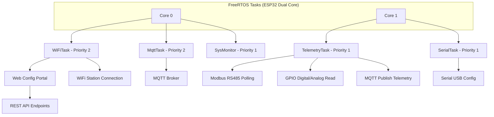

# 🔍 Analisis Mendalam Firmware Aeroponic Node (ESP32)

**Proyek**: Sistem Smart Farm Aeroponik  
**Target Firmware**: `firmware/aeroponic-node/` (ESP32 PlatformIO)  
**Arsitektur**: Multi-task FreeRTOS, MQTT, Captive Web Portal, Modbus RS485  
**Tanggal Analisis**: 9 Juli 2026  
**Analis**: Sistem AI  

---

## 📑 Daftar Isi

1. [Ringkasan Eksekutif](#1-ringkasan-eksekutif)
2. [Arsitektur Firmware Saat Ini](#2-arsitektur-firmware-saat-ini)
3. [GAP #1 — Tidak Ada Enkripsi MQTT (TLS/SSL)](#3-gap-1-tidak-ada-enkripsi-mqtt-tlsssl)
4. [GAP #2 — Inkonsistensi Topik MQTT Actuator](#4-gap-2-inkonsistensi-topik-mqtt-actuator)
5. [GAP #3 — Port MQTT Mismatch (1884 vs 1883)](#5-gap-3-port-mqtt-mismatch-1884-vs-1883)
6. [GAP #4 — Credential Default Lemah](#6-gap-4-credential-default-lemah)
7. [GAP #5 — Main Loop Hampa Tanpa Error Recovery](#7-gap-5-main-loop-hampa-tanpa-error-recovery)
8. [GAP #6 — Blocking Modbus Scan Tanpa Watchdog](#8-gap-6-blocking-modbus-scan-tanpa-watchdog)
9. [GAP #7 — Tidak Ada Edge Control / Histeresis Lokal](#9-gap-7-tidak-ada-edge-control--histeresis-lokal)
10. [GAP #8 — Tidak Ada Verifikasi OTA & Rollback](#10-gap-8-tidak-ada-verifikasi-ota--rollback)
11. [GAP #9 — Heap Fragmentation dari DynamicJsonDocument](#11-gap-9-heap-fragmentation-dari-dynamicjsondocument)
12. [GAP #10 — GPIO_HAL.h Dead Code](#12-gap-10-gpio_halh-dead-code)
13. [GAP #11 — Tidak Ada Interrupt untuk Input Digital](#13-gap-11-tidak-ada-interrupt-untuk-input-digital)
14. [GAP #12 — Tidak Ada REST Fallback untuk Telemetry](#14-gap-12-tidak-ada-rest-fallback-untuk-telemetry)
15. [GAP #13 — Konfigurasi Input Pin Kurang Komplit](#15-gap-13-struktur-inputpin-kurang-lengkap)
16. [GAP #14 — Web Portal Tidak HTTPS](#16-gap-14-web-portal-tidak-https)
17. [GAP #15 — SAVE_AND_RESPOND Macro Bermasalah](#17-gap-15-save_and_respond-macro-bermasalah)
18. [GAP #16 — Log MQTT Menumpuk di RAM](#18-gap-16-log-mqtt-menumpuk-di-ram)
19. [GAP #17 — Tidak Ada Validasi Input Serial](#19-gap-17-tidak-ada-validasi-input-serial)
20. [GAP #18 — Single Point of Failure di MQTT](#20-gap-18-single-point-of-failure-di-mqtt)
21. [Matriks Prioritas & Effort](#21-matriks-prioritas--effort)
22. [Rekomendasi Roadmap Perbaikan](#22-rekomendasi-roadmap-perbaikan)

---

## 1. Ringkasan Eksekutif

Firmware `aeroponic-node` memiliki arsitektur yang cukup baik secara modular — menggunakan FreeRTOS task terpisah untuk WiFi, MQTT, telemetry, dan serial config manager. Komponen captive web portal sangat lengkap dengan endpoint untuk konfigurasi Wi-Fi, MQTT, hardware, Modbus scanning, OTA update, hingga export/import config.

Namun, terdapat **18 gap** yang teridentifikasi dengan tingkat keparahan bervariasi:

| Kategori | Jumlah Gap |
|----------|-----------|
| 🔴 **Critical** | 4 |
| 🟡 **Medium** | 6 |
| 🟢 **Improvement** | 8 |
| **Total** | **18** |

Gap paling kritis adalah **tidak adanya enkripsi MQTT (TLS/SSL)**, **inkonsistensi format topik actuator**, **port mismatch**, dan **credential default yang lemah**. Jika tidak diperbaiki, sistem sangat rentan terhadap serangan MITM dan kegagalan komunikasi.

---

## 2. Arsitektur Firmware Saat Ini



### Aliran Data Telemetry

1. **TelemetryTask** (Core 1, setiap 5 detik):
   - Baca semua GPIO Input (digital/analog)
   - Baca semua Modbus register via RS485
   - Kumpulkan output states terakhir
   - Baca network info (IP, RSSI)
   - Format JSON
   - Publish ke MQTT topic telemetry

2. **MqttTask** (Core 0, loop terus):
   - Maintain koneksi MQTT
   - Callback saat ada pesan masuk di topic actuator
   - Parse JSON command → eksekusi `HardwareManager::setOutput()`

3. **SerialTask** (Core 1):
   - Monitor Serial USB untuk perintah konfigurasi
   - Format: `SETWIFI <ssid>;<password>` atau JSON lengkap

---

## 3. GAP #1 — Tidak Ada Enkripsi MQTT (TLS/SSL)

### 🔴 Critical

### Lokasi Kode
- **File**: `firmware/aeroponic-node/include/Config.h` (baris 52-56)
- **File**: `firmware/aeroponic-node/src/protocols/MqttManager.cpp` (baris 8-9)
- **File**: `firmware/aeroponic-node/src/core/Config.cpp` (baris 22)

### Detail Masalah
```cpp
// MqttManager.cpp - Line 8-9
WiFiClient espClient;          // ← Plain TCP, tanpa TLS
PubSubClient mqttClient(espClient);

// Config.cpp - Line 22
int MQTT_PORT = 1883;          // ← Port MQTT non-encrypted
```

Tidak ada:
- Field `MQTT_USE_TLS` (bool) di struktur konfigurasi
- Field `MQTT_CA_CERT` atau `MQTT_CERT_FILE` untuk menyimpan sertifikat CA
- Penggunaan `WiFiClientSecure` sebagai pengganti `WiFiClient`

### Dampak Teknis
1. **Semua data telemetry (sensor, suhu, pH, EC, status relay) dikirim dalam plaintext** — siapa pun yang bisa mengintersep traffic jaringan bisa membaca data sensitive farm.
2. **Credential MQTT (username & password) dikirim dalam plaintext** — bisa dicuri untuk akses tidak sah ke broker.
3. **Perintah aktuator (pompa, katup, sirine) bisa dimanipulasi** — attacker bisa mengirim perintah palsu ke ESP32 karena tidak ada verifikasi origin.

### Saran Perbaikan Spesifik

**1.1 Tambahkan field konfigurasi di `Config.h`:**
```cpp
// --- TLS Configuration ---
extern bool MQTT_USE_TLS;
extern String MQTT_CA_CERT;         // Root CA certificate as string
extern String MQTT_CLIENT_CERT;     // Client certificate (optional)
extern String MQTT_CLIENT_KEY;      // Client private key (optional)
```

**1.2 Ubah inisialisasi MQTT Client di `MqttManager.cpp`:**
```cpp
#ifdef MQTT_USE_TLS
    WiFiClientSecure espClient;
    espClient.setCACert(Config::MQTT_CA_CERT.c_str());
    if (Config::MQTT_CLIENT_CERT.length() > 0) {
        espClient.setCertificate(Config::MQTT_CLIENT_CERT.c_str());
        espClient.setPrivateKey(Config::MQTT_CLIENT_KEY.c_str());
    }
#else
    WiFiClient espClient;
#endif
PubSubClient mqttClient(espClient);
```

**1.3 Ubah port default di `Config.cpp`:**
```cpp
int MQTT_PORT = 8883;  // Default port MQTTS (TLS)
```

**1.4 Tambahkan parsing di `ConfigManager.cpp`:**
```cpp
if (doc["protocols"]["mqtt"]["use_tls"]) {
    Config::MQTT_USE_TLS = doc["protocols"]["mqtt"]["use_tls"].as<bool>();
}
```

### Effort Perbaikan: ~2-3 jam
### Risiko: Rendah (backward compatible jika TLS tidak diaktifkan)

---

## 4. GAP #2 — Inkonsistensi Topik MQTT Actuator

### 🔴 Critical

### Lokasi Kode
- **File**: `firmware/aeroponic-node/src/core/Config.cpp` (baris 29)
- **File**: `firmware/aeroponic-node/src/core/ConfigManager.cpp` (baris 107)
- **Referensi**: `docs/validasi-arsitektur-mqtt.md` (baris 29-31)

### Detail Masalah

Terdapat **3 format berbeda** untuk topik actuator:

| Sumber | Format Topik |
|--------|-------------|
| `Config.cpp` (default compiled) | `smartfarm/node-01/actuator` |
| `ConfigManager.cpp` (runtime loaded) | `smartfarm/actuator/node-01` |
| Validasi Arsitektur MQTT | `smartfarm/actuator/{Device_Name}` |

```cpp
// Config.cpp - Line 29
String TOPIC_ACTUATOR = MQTT_TOPIC_PREFIX + "/" + NODE_ID + "/actuator";

// ConfigManager.cpp - Line 107
Config::TOPIC_ACTUATOR = Config::MQTT_TOPIC_PREFIX + "/actuator/" + Config::NODE_ID;
```

### Dampak Teknis
1. Jika config.json gagal dimuat (LittleFS corrupt), ESP32 menggunakan format `smartfarm/node-01/actuator` dari default compiled.
2. Sementara Node-RED di backend mengirim perintah ke `smartfarm/actuator/node-01` (format yang benar menurut validasi arsitektur).
3. **Akibat: Node tidak pernah menerima perintah aktuator** — pompa tidak bisa dikontrol dari dashboard.
4. Kegagalan diam (silent failure) — pengguna melihat di dashboard seolah perintah terkirim, tapi relay tidak pernah berubah.

### Saran Perbaikan Spesifik

**2.1 Sinkronkan hardcoded default di `Config.cpp`:**
```cpp
// Config.cpp - Line 27-30 — Ubah menjadi:
String TOPIC_TELEMETRY = MQTT_TOPIC_PREFIX + "/" + NODE_ID + "/telemetry";
String TOPIC_ACTUATOR = MQTT_TOPIC_PREFIX + "/actuator/" + NODE_ID;    // ← Perbaiki
String TOPIC_DIAGNOSTICS = MQTT_TOPIC_PREFIX + "/" + NODE_ID + "/diagnostics";
```

**2.2 Verifikasi runtime loaded sudah benar di `ConfigManager.cpp`:**
```cpp
// ConfigManager.cpp - Line 107 — Sudah benar, pastikan tidak berubah.
Config::TOPIC_ACTUATOR = Config::MQTT_TOPIC_PREFIX + "/actuator/" + Config::NODE_ID;
```

**2.3 Tambahkan logging saat inisialisasi topik:**
```cpp
Serial.printf("MQTT Topics:\n");
Serial.printf("  Telemetry : %s\n", Config::TOPIC_TELEMETRY.c_str());
Serial.printf("  Actuator  : %s\n", Config::TOPIC_ACTUATOR.c_str());
Serial.printf("  Diagnos   : %s\n", Config::TOPIC_DIAGNOSTICS.c_str());
```

### Effort Perbaikan: ~15 menit
### Risiko: Sangat rendah

---

## 5. GAP #3 — Port MQTT Mismatch (1884 vs 1883)

### 🔴 Critical

### Lokasi Kode
- **File**: `firmware/aeroponic-node/data/config.json` (baris 19)
- **File**: `firmware/aeroponic-node/src/core/Config.cpp` (baris 22)
- **File**: `Aeroponik-Docker/docker-compose.yml` (Mosquitto port mapping)

### Detail Masalah

```json
// config.json - Line 19
"port": 1884
```

```cpp
// Config.cpp - Line 22
int MQTT_PORT = 1883;
```

Docker mosquitto expose port **1883** (MQTT) dan **8883** (MQTTS), **bukan** 1884.

### Dampak Teknis
1. ESP32 yang menggunakan file `config.json` default akan mencoba konek ke port **1884**.
2. Mosquitto broker tidak listen di port 1884 → koneksi gagal (connection refused).
3. Node tidak pernah terhubung ke MQTT → tidak ada telemetry terkirim → dashboard kosong.
4. Pengguna baru yang menjalankan sistem dari awal akan mengalami ini dan mengira sistem rusak.

### Saran Perbaikan Spesifik

**3.1 Perbaiki `data/config.json`:**
```json
"mqtt": {
    "server": "192.168.1.103",
    "port": 1883,               // ← Ganti dari 1884 ke 1883
    "topic_prefix": "smartfarm",
    "telemetry_interval_ms": 5000
}
```

**3.2 Tambahkan validasi range port di `ConfigManager.cpp`:**
```cpp
if (doc["protocols"]["mqtt"]["port"]) {
    int tmpPort = doc["protocols"]["mqtt"]["port"].as<int>();
    if (tmpPort >= 1 && tmpPort <= 65535) {
        Config::MQTT_PORT = tmpPort;
    } else {
        Serial.println("WARNING: Invalid MQTT port, using default 1883");
        Config::MQTT_PORT = 1883;
    }
}
```

### Effort Perbaikan: ~5 menit
### Risiko: Tidak ada

---

## 6. GAP #4 — Credential Default Lemah

### 🔴 Critical

### Lokasi Kode
- **File**: `firmware/aeroponic-node/data/config.json` (baris 8-9)
- **File**: `firmware/aeroponic-node/src/core/Config.cpp` (baris 6-7)

### Detail Masalah

```json
// config.json
"security": {
    "admin_user": "admin",
    "admin_pass": "admin123"
}
```

```cpp
// Config.cpp
String ADMIN_USER = "admin";
String ADMIN_PASS = "admin123";
```

### Dampak Teknis
1. Siapa pun yang terhubung ke WiFi Access Point ESP32 (SSID: `SmartFarm-node-01`) bisa mengakses portal konfigurasi.
2. Dengan credential default, attacker bisa:
   - Mengubah konfigurasi WiFi/MQTT → arahkan ke broker attacker → curi semua data
   - Upload firmware palsu via OTA → kendalikan relay (pompa, katup) dari jarak jauh
   - Export config → dapatkan semua kredensial sistem
3. ESP32 menyiarkan Access Point tanpa password — siapa pun dalam radius bisa terhubung.

### Saran Perbaikan Spesifik

**4.1 Hapus credential default dari `data/config.json`:**
```json
"security": {
    "admin_user": "",
    "admin_pass": ""
}
```

**4.2 Di `ConfigManager.cpp`, deteksi first-time setup:**
```cpp
if (Config::ADMIN_USER == "" || Config::ADMIN_PASS == "") {
    Serial.println("WARNING: No admin credentials configured!");
    Serial.println("Please configure via Captive Portal immediately.");
    
    // Generate random default password for safety
    Config::ADMIN_PASS = generateRandomPassword(12);  // Misal: "a7K9mP2xR5vL"
    
    // Force user to change on first login
    Config::ADMIN_USER = "admin";
}
```

**4.3 Tambahkan proteksi captive portal:**
```cpp
// Rate limit login attempts
struct LoginAttempt {
    IPAddress ip;
    int attempts;
    unsigned long blockUntil;
};
std::vector<LoginAttempt> loginAttempts;

void WebConfigPortal::handleApiLogin() {
    // Check if IP is blocked
    IPAddress clientIP = server.client().remoteIP();
    for (auto& attempt : loginAttempts) {
        if (attempt.ip == clientIP && millis() < attempt.blockUntil) {
            server.send(429, "application/json", "{\"error\":\"Too many attempts. Try again later.\"}");
            return;
        }
    }
    // ... existing login logic ...
}
```

**4.4 Wajibkan login captive portal sebelum akses halaman lain:**
```cpp
// Semua handler API perlu mengecek token, termasuk serveStatic
server.serveStatic("/index.html", LittleFS, "/index.html");  // Hapus ini
// Ganti dengan handler yang redirect ke login page jika belum auth
```

### Effort Perbaikan: ~2 jam
### Risiko: Rendah

---

## 7. GAP #5 — Main Loop Hampa Tanpa Error Recovery

### 🟡 Medium

### Lokasi Kode
- **File**: `firmware/aeroponic-node/src/main.cpp` (baris 35-37)
- **File**: `firmware/aeroponic-node/src/protocols/MqttManager.cpp` (baris 71-123)
- **File**: `firmware/aeroponic-node/src/core/SystemMonitor.cpp` (baris 44-56)

### Detail Masalah

```cpp
// main.cpp - Line 35-37
void loop() {
    vTaskDelay(1000 / portTICK_PERIOD_MS);  // Hampa, hanya delay 1 detik
}
```

Semua fungsi berjalan di FreeRTOS task yang independen. Jika salah satu task crash karena exception (stack overflow, null pointer, heap corruption), **tidak ada mekanisme restart task otomatis**.

### Dampak Teknis
1. Task MQTT crash → node tetap online di WiFi tapi tidak pernah publish/terima data.
2. Task telemetry crash → tidak ada data sensor terkirim, watchdog ESP32 di SystemMonitor hanya cek heap, bukan task.
3. Task WiFi crash → node konek ke AP mode tapi station mode mati.
4. Tidak ada log error yang jelas — operator tidak tahu task mana yang mati.

### Saran Perbaikan Spesifik

**5.1 Buat Task Watchdog Manager baru:**
```cpp
// src/core/TaskWatchdog.h
#ifndef TASK_WATCHDOG_H
#define TASK_WATCHDOG_H

#include <Arduino.h>
#include <vector>

struct ManagedTask {
    String name;
    TaskHandle_t handle;
    unsigned long lastHeartbeat;
    unsigned long timeoutMs;
    void (*restartFunc)();
};

class TaskWatchdog {
public:
    static void init();
    static void registerTask(String name, TaskHandle_t handle, unsigned long timeoutMs, void (*restartFunc)());
    static void heartbeat(const char* taskName);
    
private:
    static std::vector<ManagedTask> tasks;
    static void watchdogTask(void* parameter);
};

#endif
```

**5.2 Implementasi watchdog task:**
```cpp
// src/core/TaskWatchdog.cpp
void TaskWatchdog::watchdogTask(void* parameter) {
    while (true) {
        for (auto& t : tasks) {
            if (millis() - t.lastHeartbeat > t.timeoutMs) {
                Serial.printf("WATCHDOG: Task '%s' timeout! Restarting...\n", t.name.c_str());
                
                // Delete old task
                vTaskDelete(t.handle);
                
                // Create new task
                if (t.restartFunc != nullptr) {
                    t.restartFunc();  // Function that re-creates the task
                }
                
                t.lastHeartbeat = millis();
            }
        }
        vTaskDelay(5000 / portTICK_PERIOD_MS);  // Check every 5 seconds
    }
}
```

**5.3 Tambahkan heartbeat di setiap task loop:**
```cpp
// MqttManager::mqttTask
while (true) {
    TaskWatchdog::heartbeat("MqttTask");
    // ... existing logic ...
}

// HardwareManager::telemetryTask
while (true) {
    TaskWatchdog::heartbeat("TelemetryTask");
    // ... existing logic ...
}
```

### Effort Perbaikan: ~2-3 jam
### Risiko: Rendah

---

## 8. GAP #6 — Blocking Modbus Scan Tanpa Watchdog Feed

### 🟡 Medium

### Lokasi Kode
- **File**: `firmware/aeroponic-node/src/core/HardwareManager.cpp` (baris 182-228)

### Detail Masalah

```cpp
String HardwareManager::runFullScanSync(uint32_t baud) {
    // ...
    for (uint16_t id = 1; id <= 247; id++) {
        Serial.printf("Checking Slave ID %d ... ", id);
        node.begin(id, Serial2);
        uint8_t result = node.readHoldingRegisters(0, 1);
        // ...
        vTaskDelay(20 / portTICK_PERIOD_MS); // Only 20ms delay
    }
    // ...
}
```

Total iterasi: **247 ID × (20ms delay + waktu Modbus timeout ~100ms) ≈ 30 detik blocking**.

ESP32 memiliki Interrupt Watchdog (IWDG) dengan timeout default ~5 detik. Jika task tidak memberi yield/watchdog feed selama >5 detik, ESP32 akan reset.

### Dampak Teknis
1. ESP32 bisa restart di tengah scanning Modbus.
2. Scanning tidak pernah selesai — user tidak pernah mendapatkan daftar ID Modbus.
3. Di Web Portal, request HTTP ke `/api/modbus/start_scan` bisa timeout (client HTTP biasanya timeout 30 detik).

### Saran Perbaikan Spesifik

**6.1 Tambahkan esp_task_wdt_reset():**
```cpp
#include "esp_task_wdt.h"

String HardwareManager::runFullScanSync(uint32_t baud) {
    // ...
    for (uint16_t id = 1; id <= 247; id++) {
        esp_task_wdt_reset();  // Feed watchdog
        // Jika feed ke ESP32 Task Watchdog
        vTaskDelay(50 / portTICK_PERIOD_MS);
        // ...
    }
    // ...
}
```

**6.2 Atau implementasi scanning asinkron chunked:**
```cpp
// Simpan state scanning di global
struct ModbusScanState {
    bool scanning;
    uint16_t currentId;
    uint32_t baud;
    String results;
    bool firstFound;
};

ModbusScanState scanState;

void HardwareManager::startAsyncScan(uint32_t baud) {
    scanState = {true, 1, baud, "[", true};
    
    xTaskCreate(scanTask, "ModbusScan", 4096, NULL, 1, NULL);
}

void HardwareManager::scanTask(void* param) {
    while (scanState.scanning && scanState.currentId <= 247) {
        // Scan 10 IDs per iteration
        for (int i = 0; i < 10 && scanState.currentId <= 247; i++) {
            // ... scan logic ...
            scanState.currentId++;
        }
        vTaskDelay(100 / portTICK_PERIOD_MS);  // Yield to other tasks
    }
    vTaskDelete(NULL);
}
```

### Effort Perbaikan: ~1-2 jam
### Risiko: Rendah

---

## 9. GAP #7 — Tidak Ada Edge Control / Histeresis Lokal

### 🟡 Medium

### Lokasi Kode
- **File**: `firmware/aeroponic-node/src/core/HardwareManager.cpp` (baris 74-154)
- **Referensi**: `docs/validasi-arsitektur-mqtt.md` (baris 54-60)

### Detail Masalah

Firmware saat ini bertindak sebagai **pure executioner** — hanya mengeksekusi perintah dari MQTT:

```
Sensor → MQTT → Node-RED (processing) → MQTT → ESP32 (execute)
```

Jika koneksi MQTT terputus, **tidak ada logika fail-safe** di ESP32:
- Pompa bisa terus menyala meskipun suhu melebihi threshold
- Tidak ada aksi otomatis jika sensor level air menunjukkan kosong
- Tidak ada histeresis suhu untuk cooling fan

### Dampak Teknis
1. Kegagalan jaringan = kegagalan kontrol total.
2. Pompa bisa dry-run tanpa air → rusak.
3. Suhu bisa naik tanpa terkontrol → tanaman stres/rusak.

### Saran Perbaikan Spesifik

**7.1 Tambahkan struktur konfigurasi local control di `Config.h`:**
```cpp
struct LocalControlRule {
    String name;                    // "overheat_protection"
    String inputSensor;             // "temp_atas"
    String outputTarget;            // "cooling_fan"
    float thresholdHigh;            // 30.0°C → ON
    float thresholdLow;             // 25.0°C → OFF (histeresis)
    bool enabled;                   // false = skip
};

extern std::vector<LocalControlRule> LocalControlRules;
```

**7.2 Implementasikan di `HardwareManager.cpp` telemetryTask:**
```cpp
// Setelah membaca sensor, sebelum publish MQTT:
void evaluateLocalControl() {
    for (const auto& rule : Config::LocalControlRules) {
        if (!rule.enabled) continue;
        
        // Cari nilai sensor sesuai nama
        float sensorValue = getSensorValueByName(rule.inputSensor);
        if (sensorValue == NAN) continue;
        
        int currentOutput = outputStates[rule.outputTarget];
        
        if (currentOutput == 0 && sensorValue > rule.thresholdHigh) {
            setOutput(rule.outputTarget, 1);  // ON
            Serial.printf("LOCAL CONTROL: %s -> %s ON (%.1f > %.1f)\n",
                rule.name.c_str(), rule.outputTarget.c_str(), 
                sensorValue, rule.thresholdHigh);
        } 
        else if (currentOutput == 1 && sensorValue < rule.thresholdLow) {
            setOutput(rule.outputTarget, 0);  // OFF (histeresis)
            Serial.printf("LOCAL CONTROL: %s -> %s OFF (%.1f < %.1f)\n",
                rule.name.c_str(), rule.outputTarget.c_str(),
                sensorValue, rule.thresholdLow);
        }
    }
}
```

**7.3 Format konfigurasi di config.json:**
```json
"local_control": [
    {
        "name": "overheat_protection",
        "input_sensor": "s_atas_temp",
        "output_target": "cooling_fan",
        "threshold_high": 30.0,
        "threshold_low": 25.0,
        "enabled": true
    },
    {
        "name": "dry_run_protection",
        "input_sensor": "wl1_level",
        "output_target": "mist_pump",
        "threshold_high": 0,
        "threshold_low": 1,
        "enabled": true
    }
]
```

### Effort Perbaikan: ~3-4 jam
### Risiko: Sedang (perlu pengujian threshold)

---

## 10. GAP #8 — Tidak Ada Verifikasi OTA & Rollback

### 🟡 Medium

### Lokasi Kode
- **File**: `firmware/aeroponic-node/src/protocols/WebConfigPortal.cpp` (baris 394-432)

### Detail Masalah

```cpp
void WebConfigPortal::handleApiOtaUpload() {
    // ...
    if (upload.status == UPLOAD_FILE_START) {
        if (!Update.begin(UPDATE_SIZE_UNKNOWN)) {
            Update.printError(Serial);
        }
    } else if (upload.status == UPLOAD_FILE_WRITE) {
        if (Update.write(upload.buf, upload.currentSize) != upload.currentSize) {
            Update.printError(Serial);
        }
    } else if (upload.status == UPLOAD_FILE_END) {
        if (Update.end(true)) {
            Serial.printf("OTA Update Success: %u bytes\n", upload.totalSize);
        } else {
            Update.printError(Serial);
        }
    }
}
```

Masalah:
1. Tidak ada pengecekan kompatibilitas versi firmware
2. Tidak ada verifikasi signature/tanda tangan digital
3. Tidak ada mekanisme rollback jika firmware baru gagal boot
4. ESP32 dalam mode single-partition (tanpa slot factory/OTA terpisah)

### Dampak Teknis
1. Upload firmware yang corrupt/tidak cocok → **ESP32 brick total**.
2. Tidak ada cara untuk kembali ke versi sebelumnya tanpa flashing via USB.
3. Update OTA jarak jauh sangat berbahaya tanpa safety net.

### Saran Perbaikan Spesifik

**8.1 Ubah partition scheme di `platformio.ini`:**
```ini
board_build.partitions = huge_app.csv
; atau gunakan custom partition dengan 2 slot OTA
```

Custom partition `partitions.csv`:
```
nvs,      data, nvs,    0x9000,  0x5000,
otadata,  data, ota,    0xe000,  0x2000,
app0,     app,  ota_0,  0x10000, 0x1E0000,
app1,     app,  ota_1,  0x1F0000,0x1E0000,
spiffs,   data, spiffs, 0x3D0000,0x20000,
coredump, data, coredump,0x3F0000,0x10000,
```

**8.2 Tambahkan verifikasi boot count:**
```cpp
// Di main.cpp setup()
void checkBootHealth() {
    Preferences prefs;
    prefs.begin("ota", false);
    
    int bootCount = prefs.getInt("boot_count", 0);
    bootCount++;
    prefs.putInt("boot_count", bootCount);
    
    if (bootCount <= 3) {
        // First boot after OTA, record success
        prefs.putInt("boot_count", 0);
        prefs.putBool("ota_success", true);
    } else {
        // Boot failed multiple times → rollback
        Serial.println("CRITICAL: Boot failure detected! Rolling back...");
        esp_ota_set_boot_partition(esp_ota_get_next_update_partition(NULL));
        ESP.restart();
    }
    
    prefs.end();
}
```

**8.3 Tambahkan verifikasi versi di endpoint OTA:**
```cpp
void WebConfigPortal::handleApiOtaUpdate() {
    // Verifikasi versi firmware
    if (server.hasArg("fw_version")) {
        String newVersion = server.arg("fw_version");
        String currentVersion = Config::FW_VERSION;
        
        if (newVersion <= currentVersion) {
            server.send(400, "application/json", 
                "{\"error\":\"New version must be higher than current\"}");
            return;
        }
    }
    // ... proceed with OTA ...
}
```

### Effort Perbaikan: ~2-3 jam
### Risiko: Sedang (perubahan partisi memerlukan re-flash penuh via USB)

---

## 11. GAP #9 — Heap Fragmentation dari DynamicJsonDocument

### 🟡 Medium

### Lokasi Kode
- **File**: `firmware/aeroponic-node/src/core/HardwareManager.cpp` (baris 77)

### Detail Masalah

```cpp
void telemetryTask(void* parameter) {
    while (true) {
        if (MqttManager::isConnected()) {
            DynamicJsonDocument doc(4096);   // ← Alokasi baru setiap siklus!
            // ...
            serializeJson(doc, payload);
            MqttManager::publish(Config::TOPIC_TELEMETRY, payload);
        }
        // doc di-dealokasi di sini (destructor), tapi heap jadi fragmented
    }
}
```

Setiap 5 detik, alokasi 4096 bytes + internal fragmentation dari ArduinoJson. Setelah beberapa jam:
- **Large block 4KB jadi sulit dialokasikan** karena heap terpecah
- Alokasi besar bisa gagal → crash/restart
- ESP32 heap management tidak sekuat Linux — fragmentasi adalah masalah serius

### Dampak Teknis
1. Setelah 24-48 jam runtime, heap terfragmentasi.
2. `DynamicJsonDocument(4096)` gagal dialokasikan → exception → task crash.
3. Telemetry berhenti terkirim tanpa ada notifikasi.
4. Dalam kasus parah, seluruh sistem crash → watchdog reset → reboot siklus.

### Saran Perbaikan Spesifik

**9.1 Gunakan StaticJsonDocument global:**
```cpp
// Di HardwareManager.cpp
static StaticJsonDocument<4096> doc;  // Alokasi statis, tidak pernah heap

void telemetryTask(void* parameter) {
    while (true) {
        if (MqttManager::isConnected()) {
            doc.clear();  // Reset tanpa dealokasi
            
            doc["node_id"] = Config::NODE_ID;
            JsonObject network = doc.createNestedObject("network");
            network["ssid"] = Config::WIFI_SSID;
            // ... same logic ...
            
            String payload;
            serializeJson(doc, payload);
            MqttManager::publish(Config::TOPIC_TELEMETRY, payload);
        }
        vTaskDelay(delayTime / portTICK_PERIOD_MS);
    }
}
```

**9.2 Atau gunakan pre-allocated buffer:**
```cpp
char jsonBuffer[4096];  // Static buffer

void telemetryTask(void* parameter) {
    while (true) {
        if (MqttManager::isConnected()) {
            memset(jsonBuffer, 0, sizeof(jsonBuffer));
            
            // Gunakan JsonDocument dengan buffer eksternal
            StaticJsonDocument<4096> doc;
            // ... build JSON ...
            
            serializeJson(doc, jsonBuffer, sizeof(jsonBuffer) - 1);
            MqttManager::publish(Config::TOPIC_TELEMETRY, String(jsonBuffer));
        }
        vTaskDelay(delayTime / portTICK_PERIOD_MS);
    }
}
```

### Effort Perbaikan: ~1 jam
### Risiko: Rendah

---

## 12. GAP #10 — GPIO_HAL.h Dead Code

### 🟢 Improvement

### Lokasi Kode
- **File**: `firmware/aeroponic-node/src/hal/GPIO_HAL.h`

### Detail Masalah

File `GPIO_HAL.h` mendefinisikan kelas wrapper GPIO, tetapi **tidak pernah di-include atau digunakan** di manapun dalam kode:

```cpp
class GPIO_HAL {
public:
    static void initPinAsOutput(uint8_t pin) { pinMode(pin, OUTPUT); }
    static void initPinAsInput(uint8_t pin) { pinMode(pin, INPUT); }
    static void writePin(uint8_t pin, bool state) { digitalWrite(pin, state ? HIGH : LOW); }
    static bool readPin(uint8_t pin) { return digitalRead(pin) == HIGH; }
};
```

Semua operasi GPIO di `HardwareManager.cpp` menggunakan fungsi Arduino langsung (`pinMode`, `digitalWrite`, `analogRead`, `analogWrite`).

### Dampak Teknis
1. Maintenance overhead — file tidak berguna tapi tetap harus di-maintain.
2. Membingungkan developer baru yang melihat struktur folder.
3. Tidak konsisten — sebagian kode HAL, sebagian langsung Arduino.

### Saran Perbaikan Spesifik

- **Opsi A (Hapus)**: Hapus file `GPIO_HAL.h` dan folder `hal/` jika tidak akan digunakan.
- **Opsi B (Refactor)**: Implementasikan HAL secara konsisten di `HardwareManager.cpp`, misal dengan fungsi helper:
```cpp
// Di HardwareManager.cpp, tambahkan:
namespace {
    void writeOutput(uint8_t pin, const String& type, int value) {
        if (type == "PWM") {
            analogWrite(pin, constrain(value, 0, 255));
        } else {
            digitalWrite(pin, value > 0 ? HIGH : LOW);
        }
    }
    
    int readInput(uint8_t pin, const String& type) {
        return (type == "ANALOG") ? analogRead(pin) : digitalRead(pin);
    }
}
```

### Effort Perbaikan: ~5-15 menit
### Risiko: Tidak ada

---

## 13. GAP #11 — Tidak Ada Interrupt untuk Input Digital

### 🟢 Improvement

### Lokasi Kode
- **File**: `firmware/aeroponic-node/src/core/HardwareManager.cpp` (baris 99-104)

### Detail Masalah

Semua input digital (sensor level, limit switch, dll) dibaca via polling setiap 5 detik:

```cpp
JsonObject inputsObj = telemetry.createNestedObject("inputs");
for (const auto& hw : Config::HardwareInputs) {
    if (hw.type == "ANALOG") {
        inputsObj[hw.name] = analogRead(hw.pin);
    } else {
        inputsObj[hw.name] = digitalRead(hw.pin);  // ← Polling!
    }
}
```

### Dampak Teknis
1. Input yang berubah dalam waktu <5 detik bisa terlewat.
2. Emergency shutdown (misal sensor level air kosong) baru terdeteksi 5 detik kemudian — bisa terlalu lambat.
3. Pompa bisa dry-run selama 5 detik sebelum system merespon → risiko kerusakan.

### Saran Perbaikan Spesifik

**11.1 Tambahkan interrupt handler untuk input kritis:**
```cpp
// Di HardwareManager.cpp
volatile bool emergencyShutdownTriggered = false;

void IRAM_ATTR emergencyInterrupt() {
    emergencyShutdownTriggered = true;
}

void HardwareManager::init() {
    // ... existing init ...
    
    // Attach interrupt untuk input kritis
    if (Config::PIN_EMERGENCY_STOP != 255) {
        pinMode(Config::PIN_EMERGENCY_STOP, INPUT_PULLUP);
        attachInterrupt(digitalPinToInterrupt(Config::PIN_EMERGENCY_STOP), 
                        emergencyInterrupt, FALLING);
    }
}
```

**11.2 Di telemetryTask, cek flag interrupt:**
```cpp
void telemetryTask(void* parameter) {
    while (true) {
        if (emergencyShutdownTriggered) {
            emergencyShutdownTriggered = false;
            // Matikan semua output
            for (const auto& hw : Config::HardwareOutputs) {
                setOutput(hw.name, 0);
            }
            // Publish emergency alert via MQTT
            MqttManager::publish(Config::TOPIC_TELEMETRY, 
                "{\"alert\":\"EMERGENCY_SHUTDOWN\",\"node_id\":\"" + Config::NODE_ID + "\"}");
        }
        
        if (MqttManager::isConnected()) {
            // ... existing telemetry logic ...
        }
        vTaskDelay(delayTime / portTICK_PERIOD_MS);
    }
}
```

### Effort Perbaikan: ~1 jam
### Risiko: Rendah

---

## 14. GAP #12 — Tidak Ada REST Fallback untuk Telemetry

### 🟢 Improvement

### Lokasi Kode
- **File**: `firmware/aeroponic-node/src/core/HardwareManager.cpp` (baris 74-154)

### Detail Masalah

Semua data telemetry hanya dikirim via MQTT. Jika broker MQTT down atau jaringan bermasalah, data sensor hilang selamanya:

```cpp
if (MqttManager::isConnected()) {  // ← Jika MQTT disconnect, data tidak terkirim
    // ... build JSON ...
    MqttManager::publish(Config::TOPIC_TELEMETRY, payload);
}
```

### Dampak Teknis
1. Tidak ada data historis saat MQTT broker maintenance.
2. Analisis jangka panjang kehilangan data point.
3. Tidak ada queue/retry — data yang gagal terkirim langsung hilang.

### Saran Perbaikan Spesifik

**12.1 Implementasikan local queue di LittleFS:**
```cpp
// Sederhana: simpan data terakhir di file JSON dan kirim ulang saat koneksi pulih
void HardwareManager::telemetryTask(void* parameter) {
    while (true) {
        // ... build doc ...
        
        bool published = false;
        if (MqttManager::isConnected()) {
            published = MqttManager::publish(Config::TOPIC_TELEMETRY, payload);
        }
        
        if (!published) {
            // Simpan ke file queue
            appendToTelemetryQueue(payload);
            Serial.println("MQTT unavailable, queued telemetry data");
        } else {
            // Coba kirim queued data
            flushTelemetryQueue();
        }
        
        vTaskDelay(delayTime / portTICK_PERIOD_MS);
    }
}
```

**12.2 Tambahkan REST API endpoint di ESP32 sebagai secondary channel:**
```cpp
// Di WebConfigPortal
server.on("/api/telemetry/latest", HTTP_GET, []() {
    // Return latest telemetry data
    server.send(200, "application/json", latestTelemetry);
});
```

### Effort Perbaikan: ~3-4 jam
### Risiko: Sedang (wear leveling LittleFS jika banyak write)

---

## 15. GAP #13 — Struktur InputPin Kurang Lengkap

### 🟢 Improvement

### Lokasi Kode
- **File**: `firmware/aeroponic-node/include/Config.h` (baris 8-13)

### Detail Masalah

Struktur saat ini:
```cpp
struct InputPin {
    uint8_t pin;
    String type;    // "DIGITAL", "ANALOG"
    String pull;    // "UP", "DOWN", "NONE"
    String name;
};
```

Tidak ada field untuk:
- **Debounce time**: Untuk input digital yang rawan noise (misal tombol mekanik)
- **Interrupt type**: `RISING`, `FALLING`, `CHANGE`, atau `NONE`
- **Analog threshold**: Threshold untuk mengkonversi analog → digital di firmware
- **Invert**: Apakah logika input dibalik (misal NO vs NC sensor)

### Dampak Teknis
1. Input digital rawan bouncing — bisa trigger false positive.
2. Tidak bisa mengkonfigurasi interrupt input dari JSON.
3. Sensor analog tidak bisa di-set threshold-nya tanpa mengubah kode firmware.

### Saran Perbaikan Spesifik

```cpp
struct InputPin {
    uint8_t pin;
    String type;              // "DIGITAL", "ANALOG"
    String pull;              // "UP", "DOWN", "NONE"
    String name;
    uint16_t debounce_ms;     // NEW: Debounce time in ms (default 0)
    String interrupt;         // NEW: "RISING", "FALLING", "CHANGE", "NONE" (default "NONE")
    uint16_t analog_min;      // NEW: Minimum analog value for threshold (optional)
    uint16_t analog_max;      // NEW: Maximum analog value for threshold (optional)
    bool invert;              // NEW: Invert logic (true = LOW is active)
};
```

### Effort Perbaikan: ~30 menit
### Risiko: Rendah

---

## 16. GAP #14 — Web Portal Tidak HTTPS

### 🟢 Improvement

### Lokasi Kode
- **File**: `firmware/aeroponic-node/src/protocols/WebConfigPortal.cpp` (baris 16)

### Detail Masalah

```cpp
WebServer server(80);  // ← HTTP plain, tanpa enkripsi
```

Semua komunikasi dengan captive portal (termasuk credential admin, konfigurasi WiFi, API key) dikirim dalam plaintext.

### Dampak Teknis
1. Credential admin bisa dicuri dengan packet sniffing di jaringan lokal.
2. WiFi password dikirim dalam bentuk plaintext.
3. Siapa pun di jaringan yang sama bisa memonitor traffic konfigurasi.

### Saran Perbaikan Spesifik

**14.1 Gunakan ESP32 WebServer dengan HTTPS:**
```cpp
#include <WiFiClientSecure.h>
#include <AsyncTCP.h>
#include <ESPAsyncWebServer.h>

// Generate self-signed certificate di setup
void WebConfigPortal::startAP() {
    // Generate self-signed certificate for HTTPS
    // Atau gunakan library seperti ESPAsyncWebServer dengan SSL
    
    // Untuk WebServer bawaan, bisa gunakan:
    // server.begin();  // Masih HTTP
    // Tambahan: minimal gunakan Basic Auth over HTTPS
}
```

**14.2 Minimal implementasikan session-based auth dengan HTTPS redirect:**
```cpp
void handleRoot() {
    if (!checkAuthToken()) {
        server.sendHeader("Location", "/login.html");
        server.send(302, "text/plain", "");
        return;
    }
    // Serve index.html
}
```

### Effort Perbaikan: ~2-3 jam
### Risiko: Rendah (self-signed cert tidak divalidasi browser)

---

## 17. GAP #15 — SAVE_AND_RESPOND Macro Bermasalah

### 🟢 Improvement

### Lokasi Kode
- **File**: `firmware/aeroponic-node/src/protocols/WebConfigPortal.cpp` (baris 208-256)

### Detail Masalah

```cpp
#define SAVE_AND_RESPOND \
    DynamicJsonDocument doc(4096); \
    doc["device"]["node_id"] = Config::NODE_ID; \
    doc["security"]["auth_token"] = Config::AUTH_TOKEN; \
    doc["security"]["admin_user"] = Config::ADMIN_USER; \
    doc["security"]["admin_pass"] = Config::ADMIN_PASS; \
    // ... ~50 lines of JSON building ...
    String out; serializeJson(doc, out); \
    ConfigManager::saveConfig(out); \
    server.send(200, "application/json", "{\"status\":\"ok\"}");
```

### Detail Permasalahan Teknis

1. **Macro sangat panjang (49 baris)** — menyulitkan debugging.
2. **Rentan side-effect** — macro menggunakan variabel dari scope pemanggil.
3. **Tidak ada penanganan error** — jika `saveConfig` gagal, tetap mengirim status "ok".
4. **Alokasi DynamicJsonDocument(4096) setiap kali dipanggil** — heap fragmentation.
5. **HardwareInputs/HardwareOutputs/HardwareModbus tidak disimpan** — hanya sebagian data.
6. **Reboot tidak selalu diperlukan** — misalnya hanya update MQTT server seharusnya reconnect, bukan reboot.

### Dampak Teknis
1. Reboot tidak perlu → downtime tidak perlu untuk perubahan kecil.
2. Data hardware configuration tidak tersimpan jika diubah dari API handler lain.
3. Jika ada error saat build JSON, macro akan silent crash.

### Saran Perbaikan Spesifik

**15.1 Ubah macro menjadi fungsi:**
```cpp
bool saveFullConfig() {
    DynamicJsonDocument doc(4096);
    
    JsonObject device = doc.createNestedObject("device");
    device["node_id"] = Config::NODE_ID;
    
    JsonObject security = doc.createNestedObject("security");
    security["auth_token"] = Config::AUTH_TOKEN;
    security["admin_user"] = Config::ADMIN_USER;
    security["admin_pass"] = Config::ADMIN_PASS;
    
    JsonObject protocols = doc.createNestedObject("protocols");
    JsonObject wifi = protocols.createNestedObject("wifi");
    wifi["ssid"] = Config::WIFI_SSID;
    wifi["password"] = Config::WIFI_PASS;
    // ... more fields ...
    
    JsonObject mqtt = protocols.createNestedObject("mqtt");
    mqtt["server"] = Config::MQTT_SERVER;
    mqtt["port"] = Config::MQTT_PORT;
    // ... more fields ...
    
    JsonObject hardware = doc.createNestedObject("hardware");
    JsonArray inputs = hardware.createNestedArray("inputs");
    for (const auto& pin : Config::HardwareInputs) { /* ... */ }
    
    JsonArray outputs = hardware.createNestedArray("outputs");
    for (const auto& pin : Config::HardwareOutputs) { /* ... */ }
    
    JsonArray modbus = hardware.createNestedArray("modbus");
    for (const auto& ms : Config::HardwareModbus) { /* ... */ }
    
    String out;
    serializeJson(doc, out);
    return ConfigManager::saveConfig(out);
}
```

**15.2 Hapus macro dan panggil fungsi:**
```cpp
void WebConfigPortal::handleApiWifiPost() {
    if (!checkAuthToken()) return server.send(401, "...");
    // ... update Config values ...
    
    if (saveFullConfig()) {
        server.send(200, "application/json", "{\"status\":\"ok\",\"reboot\":true}");
    } else {
        server.send(500, "application/json", "{\"error\":\"Failed to save config\"}");
    }
}
```

### Effort Perbaikan: ~1 jam
### Risiko: Rendah

---

## 18. GAP #16 — Log MQTT Menumpuk di RAM

### 🟢 Improvement

### Lokasi Kode
- **File**: `firmware/aeroponic-node/src/protocols/MqttManager.cpp` (baris 11-19)

### Detail Masalah

```cpp
std::vector<String> MqttManager::mqttLogs;

void MqttManager::addLog(String logMsg) {
    String uptimeStr = "[" + String(millis() / 1000) + "s] ";
    mqttLogs.push_back(uptimeStr + logMsg);
    if (mqttLogs.size() > 15) {
        mqttLogs.erase(mqttLogs.begin());  // ← Hanya batasi 15 item
    }
}
```

Setiap log disimpan sebagai objek `String` yang dialokasikan di heap. String bisa panjang (misal: `[12345s] Pub: [smartfarm/node-01/telemetry] { ... large JSON ... }`).

### Dampak Teknis
1. 15 log × ~256 bytes average = ~4KB heap terpakai secara permanen.
2. String JSON telemetry disimpan dua kali (satu di doc, satu di log string).
3. Fragmentasi dari String::push_back/erase over time.

### Saran Perbaikan Spesifik

**16.1 Batasi panjang setiap log entry:**
```cpp
void MqttManager::addLog(String logMsg) {
    // Truncate long messages
    if (logMsg.length() > 100) {
        logMsg = logMsg.substring(0, 97) + "...";
    }
    
    String uptimeStr = "[" + String(millis() / 1000) + "s] ";
    mqttLogs.push_back(uptimeStr + logMsg);
    if (mqttLogs.size() > 10) {  // Kurangi dari 15 ke 10
        mqttLogs.erase(mqttLogs.begin());
    }
}
```

**16.2 Atau gunakan circular buffer dengan fixed char array:**
```cpp
#define MAX_LOG_ENTRIES 10
#define MAX_LOG_LENGTH 80

char logBuffer[MAX_LOG_ENTRIES][MAX_LOG_LENGTH];
int logIndex = 0;
int logCount = 0;

void MqttManager::addLog(const char* logMsg) {
    snprintf(logBuffer[logIndex], MAX_LOG_LENGTH, "[%lus] %s", 
             millis() / 1000, logMsg);
    logIndex = (logIndex + 1) % MAX_LOG_ENTRIES;
    if (logCount < MAX_LOG_ENTRIES) logCount++;
}
```

### Effort Perbaikan: ~30 menit
### Risiko: Rendah

---

## 19. GAP #17 — Tidak Ada Validasi Input Serial

### 🟢 Improvement

### Lokasi Kode
- **File**: `firmware/aeroponic-node/src/core/SerialConfigManager.cpp` (baris 62-91)

### Detail Masalah

```cpp
else if (incomingBuffer.startsWith("{") && incomingBuffer.endsWith("}")) {
    StaticJsonDocument<1024> doc;
    DeserializationError error = deserializeJson(doc, incomingBuffer);
    
    if (!error) {
        if (doc.containsKey("auth") && doc["auth"]["password"] == Config::ADMIN_PASS) {
            // ... save config and reboot ...
        }
    }
}
```

### Dampak Teknis
1. Buffer overflow potensial — tidak ada batasan panjang input buffer (`incomingBuffer`).
2. Tidak ada validasi ukuran JSON sebelum deserialisasi — payload besar bisa membanjiri heap.
3. Tidak ada timeout — attacker bisa mengirim data lambat (slow send) untuk mengikat resource.
4. Command injection — meskipun terbatas pada JSON, struktur yang tidak terduga bisa menyebabkan perilaku tidak aman.

### Saran Perbaikan Spesifik

**17.1 Batasi panjang input buffer:**
```cpp
#define MAX_SERIAL_INPUT 1024

void SerialConfigManager::serialTask(void* parameter) {
    String incomingBuffer = "";
    
    while (true) {
        while (Serial.available()) {
            char c = Serial.read();
            if (c == '\n') {
                // Process buffer
                // ...
                incomingBuffer = "";
            } else if (c != '\r') {
                if (incomingBuffer.length() < MAX_SERIAL_INPUT) {
                    incomingBuffer += c;
                } else {
                    // Buffer overflow — reset
                    incomingBuffer = "";
                    Serial.println("ERROR: Input too long, buffer reset");
                }
            }
        }
        vTaskDelay(50 / portTICK_PERIOD_MS);
    }
}
```

### Effort Perbaikan: ~30 menit
### Risiko: Rendah

---

## 20. GAP #18 — Single Point of Failure di MQTT

### 🟢 Improvement

### Lokasi Kode
- **File**: `firmware/aeroponic-node/src/core/HardwareManager.cpp` (baris 74-154)

### Detail Masalah

```cpp
void telemetryTask(void* parameter) {
    while (true) {
        if (MqttManager::isConnected()) {  // ← Hanya publish jika MQTT connected
            DynamicJsonDocument doc(4096);
            // ... build JSON ...
            MqttManager::publish(Config::TOPIC_TELEMETRY, payload);
        }
        // Jika MQTT disconnect, task hanya delay dan loop — tidak ada aksi
        vTaskDelay(delayTime / portTICK_PERIOD_MS);
    }
}
```

### Dampak Teknis
1. Jika broker MQTT down lama (jam/hari), tidak ada data yang terkumpul.
2. Tidak ada buffer/cache untuk data yang gagal terkirim.
3. Bahkan status ESP32 (online/offline) tidak bisa dipantau tanpa MQTT.

### Saran Perbaikan Spesifik

**18.1 Tambahkan LED indikator status:**
```cpp
void HardwareManager::init() {
    // ...
    pinMode(LED_BUILTIN, OUTPUT);
    digitalWrite(LED_BUILTIN, LOW);
}

// Di telemetryTask
digitalWrite(LED_BUILTIN, MqttManager::isConnected() ? HIGH : LOW);
```

**18.2 Implementasikan connection quality monitoring:**
```cpp
struct ConnectionStats {
    int mqttDisconnects;
    int mqttConnectFails;
    unsigned long lastMqttConnected;
    unsigned long uptime;
};

ConnectionStats stats;

// Di MqttManager::mqttTask
if (!mqttClient.connected()) {
    stats.mqttDisconnects++;
    // Reset counter after reconnect
}

// Di telemetryTask, publish stats periodically
if (MqttManager::isConnected()) {
    // Include stats in telemetry every 10th publish
    static int publishCount = 0;
    if (++publishCount % 10 == 0) {
        doc["connection_stats"]["mqtt_disconnects"] = stats.mqttDisconnects;
        doc["connection_stats"]["uptime_s"] = millis() / 1000;
    }
}
```

### Effort Perbaikan: ~1 jam
### Risiko: Rendah

---

## 21. Matriks Prioritas & Effort

| # | Gap | Priority | Effort | Complexitas | Dampak Keamanan | Dampak Fungsional |
|---|-----|----------|--------|-------------|-----------------|-------------------|
| 1 | MQTT tanpa TLS/SSL | 🔴 Critical | 2-3 jam | Medium | **Sangat Tinggi** | Rendah |
| 2 | Inkonsistensi topik actuator | 🔴 Critical | 15 menit | Rendah | Rendah | **Tinggi** |
| 3 | Port MQTT mismatch (1884) | 🔴 Critical | 5 menit | Rendah | Rendah | **Tinggi** |
| 4 | Credential default lemah | 🔴 Critical | 2 jam | Medium | **Sangat Tinggi** | Rendah |
| 5 | Task watchdog & error recovery | 🟡 Medium | 2-3 jam | Tinggi | Rendah | **Tinggi** |
| 6 | Blocking Modbus scan | 🟡 Medium | 1-2 jam | Medium | Rendah | **Sedang** |
| 7 | Edge control / histeresis | 🟡 Medium | 3-4 jam | Tinggi | Rendah | **Tinggi** |
| 8 | OTA rollback & verifikasi | 🟡 Medium | 2-3 jam | Tinggi | **Tinggi** | **Tinggi** |
| 9 | Heap fragmentation | 🟡 Medium | 1 jam | Rendah | Rendah | **Sedang** |
| 10 | GPIO_HAL.h dead code | 🟢 Low | 5 menit | Rendah | Tidak Ada | Tidak Ada |
| 11 | Interrupt input digital | 🟢 Low | 1 jam | Rendah | Rendah | **Sedang** |
| 12 | REST fallback telemetry | 🟢 Low | 3-4 jam | Tinggi | Rendah | **Sedang** |
| 13 | InputPin struct enhancement | 🟢 Low | 30 menit | Rendah | Rendah | Rendah |
| 14 | Web Portal HTTPS | 🟢 Low | 2-3 jam | Medium | **Sedang** | Rendah |
| 15 | SAVE_AND_RESPOND macro | 🟢 Low | 1 jam | Rendah | Rendah | Rendah |
| 16 | Log MQTT menumpuk RAM | 🟢 Low | 30 menit | Rendah | Rendah | Rendah |
| 17 | Validasi input serial | 🟢 Low | 30 menit | Rendah | **Sedang** | Rendah |
| 18 | SPOF MQTT | 🟢 Low | 1 jam | Rendah | Rendah | Rendah |

---

## 22. Rekomendasi Roadmap Perbaikan

### Fase 1 — Critical Fixes (Hari 1-2)
```
[ ] GAP #3: Port 1884 → 1883 di config.json (5 menit)
[ ] GAP #2: Sinkronisasi format topik actuator (15 menit)
[ ] GAP #4: Hapus credential default + rate limit login (2 jam)
[ ] GAP #1: Implementasi MQTT TLS/SSL (2-3 jam)
```

### Fase 2 — Medium Priority (Hari 3-4)
```
[ ] GAP #9: Ubah DynamicJsonDocument → StaticJsonDocument (1 jam)
[ ] GAP #6: Feed watchdog di Modbus scan (1 jam)
[ ] GAP #5: Task watchdog manager (2-3 jam)
[ ] GAP #7: Local control rules & histeresis (3-4 jam)
```

### Fase 3 — OTA Safety & Stability (Hari 5)
```
[ ] GAP #8: OTA partition scheme + boot health check (2-3 jam)
[ ] GAP #15: Refactor SAVE_AND_RESPOND macro (1 jam)
[ ] GAP #16: Optimasi MQTT log buffer (30 menit)
```

### Fase 4 — Enhancements (Hari 6-7)
```
[ ] GAP #11: Interrupt untuk input kritis (1 jam)
[ ] GAP #13: Tambah field InputPin (30 menit)
[ ] GAP #17: Validasi input serial (30 menit)
[ ] GAP #10: Hapus/implementasikan GPIO_HAL.h (5-15 menit)
[ ] GAP #14: HTTPS untuk web portal (2-3 jam)
[ ] GAP #12: REST fallback + local queue (3-4 jam)
[ ] GAP #18: Connection quality monitoring (1 jam)
```

**Total estimasi: ~18-22 jam kerja efektif (3-4 hari penuh)**

---

## 📎 Lampiran: Referensi Kode

### Struktur File yang Dianalisis

```
firmware/aeroponic-node/
├── include/
│   └── Config.h                          # Definisi struktur konfigurasi
├── src/
│   ├── main.cpp                          # Entry point + FreeRTOS task creation
│   ├── core/
│   │   ├── Config.cpp                    # Default compiled config values
│   │   ├── ConfigManager.cpp             # JSON config loader/saver
│   │   ├── HardwareManager.cpp           # GPIO, Modbus, telemetry logic
│   │   ├── SystemMonitor.cpp             # Heap & uptime diagnostics
│   │   └── SerialConfigManager.cpp       # USB serial configuration listener
│   ├── protocols/
│   │   ├── MqttManager.cpp               # MQTT connection, publish, callback
│   │   ├── NetworkManager.cpp            # WiFi station + captive portal
│   │   └── WebConfigPortal.cpp           # HTTP server + REST API endpoints
│   └── hal/
│       └── GPIO_HAL.h                    # (Dead code) GPIO wrapper
└── data/
    └── config.json                       # Default configuration file
```

### Dependencies (platformio.ini)

| Library | Versi | Fungsi |
|---------|-------|--------|
| PubSubClient | ^2.8 | MQTT client |
| ArduinoJson | ^6.21.3 | JSON serialization |
| DHT sensor library | ^1.4.4 | DHT11/22 sensor |
| Adafruit Unified Sensor | ^1.1.9 | Sensor abstraction |
| ModbusMaster | ^2.0.1 | Modbus RTU over RS485 |
| FreeRTOS | Built-in ESP32 | Task scheduling & semaphores |

---

*Dokumen analisis ini dibuat berdasarkan source code lengkap firmware `aeroponic-node` per 9 Juli 2026. Setiap gap disertai lokasi kode spesifik (file:baris) dan saran perbaikan yang dapat langsung diimplementasikan.*